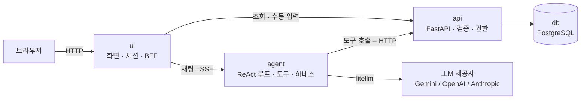

# account-book

AI 에이전트가 들어가는 가계부. 사람이 "어제 점심 김밥천국 8500원 카드로"라고 말하면
에이전트가 그걸 거래 한 건으로 바꿔 기록하고, "이번 달 식비 얼마 썼지?"라고 물으면
직접 집계해서 답한다.

서버 에이전트 구성으로 간다. 컨테이너 안에서 도는 에이전트가 API를 호출해 일한다.
도메인 서버(`api`)와 에이전트(`agent`)는 화면을 갖지 않는 **헤드리스**이고, 사람이 보는
화면은 별도의 `ui` 서버가 맡는다. 전체는 docker compose 하나로 뜬다.

> 이 문서는 **설계 문서**다. 아직 코드는 없고, 여기서 정한 형태대로 다음 단계에서
> `docker-compose.yml` / `.env.sample` / 서비스 코드를 붙인다.
>
> 코드를 쓰기 전에 [docs/development-rules.md](docs/development-rules.md)를 읽는다 —
> 파일·클래스 규칙, 계층 의존 규칙, 테스트 배치가 거기 있다.

---

## 1. 왜 에이전트인가

보통의 가계부에서 사람이 하는 일은 대부분 **번역 노동**이다. 머릿속의
"어제 점심 김밥천국 8500원"을 날짜 필드, 금액 필드, 카테고리 드롭다운으로 옮기는 일.
그리고 **집계 노동**. 이번 달 식비가 예산 안에 있는지 확인하려고 화면을 옮겨 다니는 일.

에이전트 가계부는 이 두 가지를 대화로 흡수한다.

| | 일반 가계부 | 에이전트 가계부 |
|---|---|---|
| 입력 | 폼에 필드별로 입력 | 자연어 한 줄 → 에이전트가 구조화 |
| 분류 | 사용자가 카테고리 선택 | 규칙 + LLM 추론, 애매하면 되물음 |
| 조회 | 화면·필터를 사람이 조작 | "지난달보다 식비 늘었어?" 한 줄 |
| 리포트 | 고정된 차트 | 질문에 맞춰 그때그때 집계·설명 |
| 예산 | 초과 후 알림 | 기록 시점에 "이 페이스면 3일 뒤 초과" |

핵심은 LLM이 **가계부를 대신 쓰는 게 아니라**, 가계부 API를 **도구로 호출**한다는 점이다.
금액을 LLM이 계산하지 않는다. 합계는 항상 DB가 낸다. LLM은 "무엇을 물어볼지"만 정한다.
이게 숫자를 지어내지 않게 만드는 유일한 방법이다.

## 2. 에이전트가 맡는 일

1. **기록 (capture)** — 자연어/영수증 텍스트 → `transactions` 한 건. 날짜·금액·결제수단·가맹점 추출.
2. **분류 (classify)** — 가맹점명으로 카테고리 추론. 규칙 테이블 우선, 미스나면 LLM, 그래도 애매하면 사용자에게 확인.
3. **질의 (ask)** — "이번 달 카페에 얼마?" → 집계 도구 호출 → 숫자 + 한 줄 해석.
4. **요약 (report)** — 주간/월간 리포트. 큰 변화가 있는 항목만 골라 설명.
5. **경고 (watch)** — 예산 소진 속도, 평소와 다른 지출, 중복 결제 의심 건 지적.

## 3. 시스템 구성

`api`와 `agent`는 헤드리스다. 화면을 갖지 않고 HTTP만 말한다. 사람이 보는 화면은
별도의 `ui` 서버가 맡고, 브라우저는 `ui`만 안다.



docker compose 서비스는 넷이다.

| 서비스 | 역할 | 포트 | 비고 |
|---|---|---|---|
| `ui` | 화면. 채팅창, 거래 목록, 리포트. 브라우저의 유일한 접점 | 8080 — **외부 공개** | 도메인 로직 없음 |
| `agent` | 에이전트 런타임. ReAct 루프, 도구 정의, 하네스 | 8001 — 내부 | DB 접속 정보를 **모른다** |
| `api` | FastAPI. 가계부 도메인의 **단일 진실 공급원**. CRUD·집계·검증·권한 | 8000 — 내부 | DB에 접근하는 유일한 서비스 |
| `db` | PostgreSQL. 거래·예산·감사 로그의 저장소 | 5432 — 내부 | 볼륨으로 영속화 |

호스트로 포트를 여는 건 `ui` 하나뿐이다. `agent`·`api`·`db`는 compose 내부 네트워크에만 붙는다.
LLM 호출은 `litellm`으로 추상화해서 Gemini / OpenAI / Anthropic 중 아무 키나 하나로 돌아가게 한다.

### 경계 두 개

이 구성의 값어치는 서비스 개수가 아니라 아래 두 선이 어디 그어져 있느냐에 있다.

**1. `agent` → `api`** — 에이전트는 DB에 직접 붙지 못하고 오직 `api`의 엔드포인트만 호출할 수
있다. 덕분에 "에이전트가 할 수 있는 일"의 목록이 곧 API 표면이 되고, 권한·검증·감사를
한 군데(`api`)에서만 지키면 된다. 에이전트가 오작동해도 API가 거부하는 일은 일어나지 않는다.

**2. `ui` → 나머지** — ui는 화면과 세션만 갖는다. 금액을 계산하지 않고, 권한을 판단하지 않고,
DB도 LLM도 모른다. 화면을 전부 갈아엎어도 도메인 규칙은 그대로다. 반대로 CLI든 슬랙 봇이든
클라이언트를 하나 더 붙이는 일은 `ui` 자리에 하나 더 세우는 일이 된다.

### ui 서버의 범위

**한다** — 채팅 화면(SSE로 에이전트 응답 스트리밍), 쓰기 확인 UI(에이전트가 올린 제안을
카드로 그리고 확인/취소 버튼을 받는다), 거래 목록·필터, 월간 리포트 화면, 세션 관리.

**안 한다** — 집계 계산, 카테고리 추론, 권한 판단, DB 접근, LLM 호출. 하나라도 하기 시작하면
같은 규칙이 두 군데에 생긴다.

스택은 **FastAPI + Jinja2 + HTMX**로 간다. 저장소 전체가 파이썬이라 `Dockerfile`과
`requirements.txt`를 그대로 재사용할 수 있고, 노드 툴체인이 끼지 않는다. 화면이 채팅 + 목록 +
리포트 정도면 HTMX의 부분 갱신으로 충분하다. SPA가 필요해지면 그때 `ui`만 Next.js로 바꾼다 —
경계 2 덕분에 다른 서비스는 건드릴 게 없다.

## 4. 도구 (tools)

에이전트에게 주는 도구 목록이 곧 에이전트의 능력 범위다. 읽기는 자유롭게, 쓰기는 좁게 준다.

| 도구 | 하는 일 | 권한 |
|---|---|---|
| `search_transactions` | 기간·카테고리·가맹점으로 거래 조회 | 읽기 — 자동 |
| `summarize_spending` | 기간별/카테고리별 합계·비교 | 읽기 — 자동 |
| `get_budget_status` | 예산 대비 소진율, 잔여일 기준 페이스 | 읽기 — 자동 |
| `suggest_category` | 가맹점명 → 카테고리 후보 + 신뢰도 | 읽기 — 자동 |
| `create_transaction` | 거래 1건 기록 | 쓰기 — **확인 필요** |
| `update_transaction` | 금액·카테고리·메모 수정 | 쓰기 — **확인 필요** |
| `delete_transaction` | 거래 삭제 | 쓰기 — **항상 확인** |
| `set_budget` | 카테고리 월 예산 설정 | 쓰기 — **확인 필요** |

도구 입출력 스키마는 Pydantic으로 정의한다. LLM이 "8500원"을 `8500`으로,
"어제"를 실제 날짜로 바꿔 넣게 만드는 건 프롬프트가 아니라 스키마 + 검증이다.

## 5. 대화가 실제로 도는 모양

```
사용자: 어제 점심 김밥천국 8500원 카드로

  [agent] suggest_category("김밥천국")        → 식비 (0.94)
  [agent] create_transaction(...)             → 확인 대기

에이전트: 이렇게 기록할게요.
          2026-09-16 · 식비 · 8,500원 · 카드 · 김밥천국
          맞나요?

사용자: 응

  [api]   INSERT transactions ... (source=agent, run_id=...)
  [agent] get_budget_status("식비", "2026-09")

에이전트: 기록했어요.
          이번 달 식비 182,300원 / 예산 300,000원 (61%).
          남은 13일을 지금 페이스로 쓰면 예산을 32,000원쯤 넘깁니다.
```

쓰기는 항상 **제안 → 확인 → 실행** 세 박자다. 에이전트가 말없이 돈 기록을 바꾸는 일은 없다.

## 6. 하네스 (harness)

에이전트를 서버에 두는 순간 필요한 안전장치들. 기능보다 이쪽이 더 중요하다.

- **권한 게이트** — 쓰기 도구는 사용자 확인을 거친다. 금액 임계값(예: 10만 원) 이상은 확인 문구에 금액을 다시 노출한다.
- **인젝션 방어** — 영수증 OCR 텍스트, 가맹점명, 메모는 전부 *데이터*다. 거기 적힌 문장은 지시로 취급하지 않는다. 외부 문자열은 경계 마커로 감싸 프롬프트에 넣는다.
- **비용 가드** — 루프 최대 스텝 수, 요청당 토큰/비용 상한. 초과하면 루프를 끊고 사람에게 넘긴다.
- **감사 로그** — 모든 에이전트 실행을 `agent_runs`에, 모든 도구 호출을 `tool_calls`에 남긴다. "이 거래는 왜 여기 있지?"에 답할 수 있어야 한다.
- **출처 표시** — 모든 거래에 `source`(manual / agent / import)를 박는다. 에이전트가 만든 기록은 언제나 구분된다.

## 7. 데이터 모델 (초안)

| 테이블 | 핵심 컬럼 |
|---|---|
| `accounts` | id, name, kind(cash/card/bank) |
| `categories` | id, name, parent_id |
| `transactions` | id, occurred_at, amount, direction(in/out), account_id, category_id, merchant, memo, **source**, **run_id** |
| `budgets` | id, category_id, period(YYYY-MM), limit_amount |
| `agent_runs` | id, utterance, model, steps, tokens, cost_usd, status |
| `tool_calls` | id, run_id, tool, args, result, confirmed_at |
| `idempotency_keys` | key, request_hash, response, status_code, created_at |

금액은 정수 최소단위(원)로 저장한다. 부동소수점은 쓰지 않는다.
시간은 전부 `TIMESTAMPTZ`에 UTC로 저장하고, "이번 달" 같은 경계는 사용자 타임존으로 계산한다.
`idempotency_keys`가 필요한 이유는 [docs/api-contract.md 3장](docs/api-contract.md#3-멱등성--같은-거래가-두-번-들어가지-않게)에 있다.

## 8. 예정 디렉터리 구조

서비스마다 clean architecture 네 계층(`domain` / `application` / `infrastructure` /
`interfaces`)을 두고, `tests/`는 `src/`를 그대로 미러링한다. 계층별 의존 규칙과 파일 규칙은
[docs/development-rules.md](docs/development-rules.md)에 있다.

```
account-book/
├── src/
│   ├── api/             # 도메인 로직, 유일한 DB 접근자
│   ├── agent/           # 에이전트 런타임 — 헤드리스
│   ├── ui/              # 화면 서버 — 도메인 로직 없음
│   └── shared/          # 서비스 공통 — 도메인 지식 없음
├── tests/               # src/와 같은 구조. LLM 호출 없는 목 기반 테스트
├── docs/                # 다른 프로젝트에도 통하는 규칙
│   ├── development-rules.md
│   ├── api-contract.md
│   └── git-flow-guide.md
├── ui_docs/             # 이 프로젝트에만 해당하는 화면 설계
│   ├── ui-design.md     # 모든 화면에 걸리는 공통 규칙
│   └── pages/           # 화면 하나에 문서 하나
│       ├── chat.md
│       ├── transactions.md
│       ├── transaction-form.md
│       ├── reports.md
│       └── budgets.md
├── scripts/               # 룰 검사 스크립트
├── mock_ui/               # 서버 없는 목 화면 — 설계를 눈으로 본다
├── .devcontainer/         # Codespaces·Dev Containers — dev 서비스를 그대로 쓴다
├── Makefile               # 모든 명령은 컨테이너 안에서 돈다
├── Dockerfile
├── docker-compose.yml
├── pyproject.toml         # ruff · mypy · pytest 설정
├── requirements.txt       # 런타임 의존성
├── requirements-dev.txt   # 개발 도구
└── .env.sample
```

서비스 하나를 펼치면 이렇다.

```
src/api/
├── domain/              # 엔티티·값 객체 — 프레임워크를 모른다
├── application/         # 유스케이스, 포트(추상 인터페이스)
├── infrastructure/      # 리포지토리 구현, DB 세션, 외부 클라이언트
├── interfaces/          # 라우터, 요청·응답 스키마
└── main.py              # 조립 지점
```

## 9. 실행 방법

### 지금 되는 것 — 개발 기반

```bash
make up       # .env를 만들고 도구 컨테이너를 띄운다
make all      # 규칙 검사 + 린트 + 타입 + 테스트
make shell    # 컨테이너 안으로
```

호스트에 필요한 건 `make`와 docker뿐이다. 파이썬도 ruff도 mypy도 설치하지 않는다.
명령 목록은 그냥 `make`.

화면 설계를 눈으로 보려면 `make mock` — 서버 없는 정적 목 UI가
<http://localhost:8080>에 뜬다([mock_ui/README.md](mock_ui/README.md)).

compose에는 지금 `dev` 컨테이너 하나뿐이다. `db`·`api`·`agent`·`ui`는 각 코드가
생길 때 붙는다.

### GitHub Codespaces에서 열기

저장소를 Codespaces나 VS Code Dev Containers로 열면 **같은 컨테이너가 그대로 뜬다.**
`.devcontainer/devcontainer.json`이 `docker-compose.yml`의 `dev` 서비스를 재사용하기
때문이다 — 개발 환경을 두 벌 관리하지 않는다.

열리면 `.env`가 자동으로 만들어지고, 터미널에서 바로 `make check`를 칠 수 있다.
터미널이 이미 컨테이너 안이라는 걸 Makefile이 알아채고 `docker compose exec`를 건너뛴다.
호스트에서 치든 컨테이너 안에서 치든 같은 명령이다.

### 서비스가 생긴 뒤

```bash
docker compose up --build -d
docker compose exec api python -m api.seed   # 카테고리 초기 데이터
```

브라우저에서 <http://localhost:8080> — `ui`만 호스트로 열려 있다.
에이전트만 따로 확인하고 싶으면 CLI로도 붙을 수 있다.

```bash
docker compose exec agent python -m agent.main
```

`.env.sample`에는 실제 키를 절대 넣지 않는다. `.env`는 gitignore 되어 커밋되지 않는다.

예정 환경변수:

```
# LLM — 셋 중 하나만 채우면 된다
GEMINI_API_KEY=
OPENAI_API_KEY=
ANTHROPIC_API_KEY=
AGENT_MODEL=

# 공통 — "어제", "이번 달"의 경계를 이 타임존으로 계산한다
USER_TIMEZONE=

# DB
POSTGRES_USER=
POSTGRES_PASSWORD=
POSTGRES_DB=

# 에이전트 하네스
AGENT_MAX_STEPS=
AGENT_MAX_COST_USD=
AGENT_CONFIRM_THRESHOLD=

# 서비스 주소 — compose 내부 네트워크 기준
API_BASE_URL=
AGENT_BASE_URL=

# ui
UI_PORT=
UI_SESSION_SECRET=
```

## 10. 범위

**한다**: 자연어 기록, 자동 분류, 대화형 조회, 월간 리포트, 예산 경고, 감사 로그,
그리고 이것들을 쓰는 웹 화면(`ui`). 대화로 넣는 길과 폼으로 직접 넣는 길을 **둘 다** 둔다
([ui_docs/ui-design.md 2장](ui_docs/ui-design.md#2-입력-경로는-둘이다)).

**아직 안 한다**: 은행·카드사 연동(수동 입력과 CSV 가져오기로 시작), 다중 사용자,
영수증 이미지 OCR(텍스트 입력이 먼저), 모바일 앱.

## 11. 브랜치 전략

git-flow(classic). `main`은 릴리스, `develop`이 기본 작업 브랜치,
기능은 `feature/*`로 딴다.

```bash
git flow feature start <name>
# ... 작업 ...
# finish 전에 바뀐 파일을 개발 룰 기준으로 점검한다
git flow feature finish <name>
```

브랜치 구성, finish 전 점검 절차, release·hotfix 흐름은
[docs/git-flow-guide.md](docs/git-flow-guide.md)에 있다.
