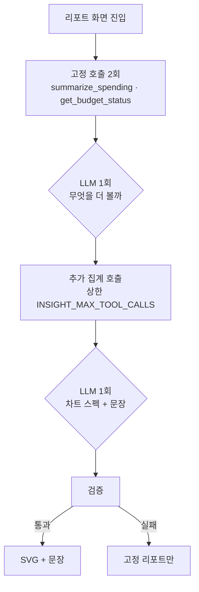

# 상황에 맞는 통계

## 1. 목적

고정 리포트는 매달 같은 그림을 그린다. 카테고리 막대, 여섯 달 추이, 예산 페이스.
대부분의 달에는 그걸로 충분하다. 문제는 **그렇지 않은 달**이다.

이사한 달에는 주거비 한 건이 모든 막대를 눌러버려서 나머지가 안 보인다. 병원에 다닌 달에는
없던 카테고리가 3위로 올라온다. 카드를 바꾼 달에는 결제수단 분포가 리포트에서 가장 할 말이
많은 그림이 된다. **볼 만한 그림이 달마다 다르다.**

이 기능은 그걸 AI가 정하게 한다. 도구로 집계를 몇 개 내보고, 그중 이 달에 말이 되는 것을
골라 그림 한두 장과 문장 두세 줄로 낸다. 고정 리포트를 **대체하지 않고 위에 얹힌다.**

세 기능 중 자유도가 가장 높다. 기능 1은 답이 카테고리 목록 안에 있었고, 기능 2는 도구
조합 안에 있었다([chat-analytics.md](chat-analytics.md)). 여기는 **질문 자체를 AI가 만든다.**
그래서 검증이 가장 빡빡하다.

---

## 2. 경계 — 무엇을 AI가 정하나

| | LLM이 정한다 | 코드가 정한다 |
|---|---|---|
| 관점 | 이 달에 무엇을 볼지 | 처음 두 호출은 고정(4장) |
| 도구 | 추가로 어느 집계를 부를지 | 도구 목록. 읽기 전용, 호출 수 상한 |
| 그림 | 어떤 형태로 그릴지 (스펙) | 그릴 수 있는 형태 목록, 축, 색, 눈금 |
| 숫자 | **하나도 정하지 않는다** | 전부 `api`의 집계값 |
| 데이터 | 어느 도구 결과를 쓸지 (참조) | 값 자체는 스펙에 들어가지 않는다(5장) |
| 문장 | 두세 줄 | 길이·금지 규칙(6장) |

핵심은 마지막 두 줄이다. **LLM은 그림에 들어갈 숫자를 쓰지 않는다.** "어느 도구 결과의 어느
필드를 어떤 형태로 그려라"까지만 말하고, 값은 코드가 그 참조를 따라가 채운다. 그림이
거짓말할 수 있는 경로가 이 규칙 하나로 닫힌다.

---

## 3. 집계 도구

`api`가 계산하고 `agent`가 부른다. 전부 읽기다.

| 도구 | 돌려주는 것 | 이 기능에서 쓰는 데 |
|---|---|---|
| `summarize_spending` | 기간·카테고리별 합계 | 어디에 썼나 |
| `compare_periods` | 두 기간 카테고리별 증감 | 무엇이 달라졌나 |
| `count_frequency` | 건수·날 수·평균 간격 | 금액이 아니라 횟수가 달라진 경우 |
| `get_budget_status` | 소진율·페이스 | 예산을 정한 카테고리 |
| `detect_outliers` | 평소 범위를 벗어난 건 | 큰 한 건이 평균을 먹은 달 |
| `search_transactions` | 거래 목록(상한 있음) | 문장에 예시 한 건을 들 때 |

`detect_outliers`의 **기준은 `api`가 정한다.** 카테고리별 최근 여섯 달의 중앙값과 산포로
판정하고, LLM은 임계값을 정하지 않는다. 임계값을 모델이 말하기 시작하면 같은 데이터가
달마다 다르게 특이해진다.

늘어나는 도구와 엔드포인트는 [README.md 7장](README.md#7-계약에-늘어나는-것)에 모아 둔다.

---

## 4. 흐름 — 훑고, 계획하고, 조립한다



plan-and-execute다. 집계들이 서로 독립이라서 계획을 한 번 세우고 동시에
부른다([agent-loop.md 5장](agent-loop.md#5-plan-and-execute--기능-3의-흐름)).

**처음 두 호출은 코드가 정한다.** 빈손으로 계획을 시키면 헛호출이 난다 — 데이터가 어떻게
생겼는지 모르는 상태에서는 "일단 다 불러 보자"가 가장 합리적인 선택이 되기 때문이다.
기본 집계를 손에 들려주고 나서 "여기서 더 볼 게 있나"를 묻는다.

LLM 호출은 두 번, 집계 호출은 많아도 여섯 번이다. 상한에 닿으면 그 시점까지 모인 것으로
조립한다. 리포트는 **덜 보여줄 수 있어도 늦으면 안 된다.**

---

## 5. 차트 스펙 — 그림은 선언으로 온다

`ui`는 차트 라이브러리를 쓰지 않고 서버에서 인라인 SVG를
그린다([../../ui_docs/ui-design.md 7장](../../ui_docs/ui-design.md#7-지금-하지-않는-것)).
그래서 AI가 낼 것은 그림이 아니라 **무엇을 그릴지에 대한 선언**이다.

```json
{
  "charts": [
    {
      "kind": "hbar",
      "title": "9월에 어디에 썼나",
      "source": "call_1",
      "x_field": "category_name",
      "y_field": "amount",
      "unit": "KRW",
      "annotate": ["housing"],
      "note": "이사 비용 한 건이 포함된 달"
    }
  ],
  "highlights": [
    { "text": "식비가 지난달보다 62,000원 늘었습니다.", "source": "call_2" }
  ]
}
```

| 필드 | 뜻 | 검증 |
|---|---|---|
| `kind` | `bar` · `hbar` · `line` 중 하나 | 목록 밖이면 버린다. **`pie`는 목록에 없다** |
| `source` | 어느 도구 호출의 결과인가 | 이번 실행에서 실제로 부른 `call_id`만 |
| `x_field` · `y_field` | 그 결과의 어느 필드인가 | 결과 스키마에 있는 필드만 |
| `unit` | `KRW` · `count` · `days` | 축 라벨과 서식이 여기서 결정된다 |
| `annotate` | 숫자를 직접 달 지점 | 최대 2개. 전부 달면 아무것도 읽히지 않는다 |
| `note` | 그림 밑 한 줄 | 선택. 숫자를 쓰지 않는다 |

스펙에 **데이터 배열이 없다.** `source`와 필드 이름만 있고 값은 코드가 채운다. LLM이
`"data": [412000, 88000]`을 써 보내면 그 스펙은 버린다 — 지어낸 숫자인지 확인할 방법이
없고, 확인할 수 없는 건 쓰지 않는다.

색·축·눈금·범례는 스펙에 없다. 전부 렌더러가
정한다([../../ui_docs/pages/reports.md 3.1](../../ui_docs/pages/reports.md#31-차트-규칙)).
파이 차트를 쓰지 않고, 축을 둘로 나누지 않고, 색만으로 계열을 구분하지 않는다는 규칙은
**스펙에 그런 필드를 두지 않는 방식으로** 지킨다. 문서에 적어 두는 것과 표현할 수 없게
만드는 것은 다른 일이다.

---

## 6. 문장 — "눈에 띈 것"

리포트의 마지막 영역이다([../../ui_docs/pages/reports.md 3.2](../../ui_docs/pages/reports.md#32-눈에-띈-것은-문장으로-낸다)).
`ui`에는 이 자리를 위한 `ReportNarrator` 포트가 이미 있고, 지금은 규칙 문구를 내는 대역이
서 있다. 진짜가 오는 자리가 여기다.

규칙 넷.

1. **세 줄까지.** 넷째 줄부터는 읽히지 않는다. 큰 변화만 고른다.
2. **숫자는 도구 결과의 값만.** 문장의 숫자를 집합과 대조하는 검사는 기능 2와
   같다([chat-analytics.md 7.2](chat-analytics.md#72-숫자-검증--답변에-있는-숫자가-도구에서-온-것인가)).
3. **원인을 추측하지 않는다.** "배달을 많이 시켜서 늘었습니다"는 데이터에 없는 말이다.
   "식비가 62,000원 늘었고, 그중 38,000원이 주말에 있었습니다"까지가 데이터가 받쳐 준다.
4. **훈계하지 않는다.** "아껴 쓰세요", "과소비입니다" 금지. 가계부는 사람을 꾸짖는 물건이
   아니고, 사용자가 자기 돈으로 무엇을 할지 판단할 근거만 준다.

4번은 금지어 목록으로 검사한다. 프롬프트에 적어만 두면 언젠가 새어 나오고, 그 한 줄이
"이거 다시는 안 켜"가 된다.

---

## 7. 검증과 폴백

| 검사 | 걸리면 |
|---|---|
| 스키마가 맞나 | 한 번 다시 시킨다 |
| `kind`가 허용 목록에 있나 | 그 차트만 버린다 |
| `source`가 실제 호출한 id인가 | 그 차트만 버린다 |
| `x_field`·`y_field`가 결과에 있나 | 그 차트만 버린다 |
| 스펙에 값 배열이 들어왔나 | 그 차트만 버린다 |
| 문장의 숫자가 도구 결과에 있나 | 그 문장만 버린다 |
| 금지어가 있나 | 그 문장만 버린다 |
| 남은 차트·문장이 0개인가 | **AI 영역을 아예 그리지 않는다** |

버리는 단위가 차트 하나, 문장 하나다. 하나가 틀렸다고 리포트를 통째로 내리지 않는다.

| 상황 | 화면 |
|---|---|
| 전부 실패·장애·타임아웃 | 고정 리포트만. AI 영역은 없다 |
| 키가 없다 | 같다. 대역이 내는 규칙 문구가 그 자리에 선다 |
| 스펙은 통과, 문장만 실패 | 그림만 |

**리포트는 AI를 기다리지 않는다.** 페이지는 고정 영역을 다 채워서 먼저 보내고, AI 영역만
HTMX로 뒤에 채운다([../../ui_docs/ui-design.md 5장](../../ui_docs/ui-design.md#5-htmx-사용-규칙)).

```html
<div id="ai-insights" hx-get="/reports/2026-09/insights" hx-trigger="load"></div>
```

첫 화면이 3초 늦는 리포트는 아무도 다시 열지 않는다.

---

## 8. 캐시 — 시간이 아니라 버전으로

같은 달을 두 번 열면 같은 리포트가 나와야 하고, 두 번째는 공짜여야 한다.

캐시 키는 넷을 묶는다.

```
period · data_version · prompt_version · model
```

`data_version`은 그 기간 거래의 `max(updated_at)`과 건수로 만든다. **TTL을 쓰지 않는다.**
시간 기반 만료는 두 가지를 동시에 틀린다 — 아무것도 안 바뀌었는데 다시 부르고, 방금
거래를 고쳤는데 옛 리포트를 준다. 데이터가 바뀌면 키가 바뀌는 게 맞다.

`prompt_version`과 `model`을 키에 넣는 이유는 프롬프트를 고친 뒤에도 옛 결과가 나오면
평가를 신뢰할 수 없기 때문이다. 지난달 리포트는 한 번 만들면 다시 만들 일이 거의 없다 —
과거 데이터는 안 바뀐다. 그게 이 기능을 쓸 만하게 만드는 사실이다.

---

## 9. 평가

고정 데이터 세트를 셋 둔다. `tests/fixtures/ai/reports/`.

| 세트 | 어떤 달인가 | 기대 |
|---|---|---|
| 평범한 달 | 특이한 게 없다 | 고정 리포트와 비슷한 그림. **억지 발견을 만들지 않는다** |
| 큰 한 건이 있는 달 | 이사·보험 일시납 | 그 건을 집어낸다. 나머지 막대를 눌러 그리지 않는다 |
| 새 카테고리가 생긴 달 | 병원·교육 | 새로 생긴 것을 언급한다 |

| 지표 | 목표 | 어떻게 |
|---|---|---|
| 스펙 유효율 | 95% 이상 | 검증을 통과한 차트 비율 |
| 재현성 | 같은 입력 → 같은 스펙 | `temperature=0`, 스냅샷 비교 |
| 금지어 | 0건 | 목록 검사 |
| 숫자 일치 | 100% | 기능 2와 같은 대조 |
| 억지 발견 | 없다 | 평범한 달에서 "발견"을 몇 개 냈나 |
| p95 지연 | 3초 | AI 영역만. 페이지는 먼저 뜬다 |

**평범한 달에서 조용한지**가 이 기능에서 가장 어려운 항목이다. 모델은 시킨 일을 하려고
하고, 그래서 아무 일도 없는 달에도 무언가를 찾아낸다. 그렇게 나온 문장은 틀리진 않지만
쓸모가 없고, 매달 쌓이면 사용자가 그 영역을 안 읽게 된다.

스냅샷 테스트는 스펙만 고정한다. 문장은 고정하지 않는다 — 같은 뜻을 다르게 쓰는 걸
실패로 보면 테스트가 프롬프트를 못 고치게 만든다. 문장은 규칙 검사(길이·숫자·금지어)와
사람 눈으로 본다. 실제 모델을 부르는 쪽은 `-m
integration`이다([../development-rules.md 4.3](../development-rules.md#43-테스트는-llm을-호출하지-않는다)).

---

## 10. 결정과 이유

- **왜 스펙인가.** LLM에게 SVG나 차트 코드를 쓰게 하면 검증할 것이 코드가 되고, 색 규칙과
  축 규칙이 매번 새로 무너진다. 선언으로 받으면 허용 목록으로 검사할 수 있고, 렌더러를
  고치면 지난 리포트까지 같이 좋아진다.
- **왜 숫자를 스펙에서 뺐나.** 그림이 조용히 거짓말하는 게 가장 나쁜 실패다. 문장은 읽으면
  이상한 걸 알아채지만, 막대 길이는 아무도 검산하지 않는다.
- **왜 처음 두 호출을 고정했나.** 4장. 빈손 계획은 헛호출로 간다.
- **왜 차트를 최대 두 장만 두나.** 리포트의 나머지가 이미 고정 차트로 차 있다.
  AI 영역이 커지면 화면의 중심이 검증이 덜 된 쪽으로 옮겨 간다.
- **왜 캐시를 버전으로 하나.** 8장.
- **왜 훈계를 금지하나.** 6장의 4번. 한 줄이 기능 전체를 끄게 만든다.
- **왜 고정 리포트를 남겨 두나.** AI가 얹히는 층이면 꺼도 화면이 돈다. 이게 임계값을 높게
  잡고, 검증에서 과감하게 버릴 수 있는 이유다([README.md 2장](README.md#2-모든-ai-기능에-걸리는-원칙) 원칙 8).

---

## 11. 하지 않는 것

- **코드 실행.** 파이썬을 짜서 돌리는 방식(코드 인터프리터)은 쓰지 않는다. 집계는 도구가
  하고, 도구에 없는 집계는 도구를 늘려서 한다.
- **예측선·추세 외삽.** 페이스 환산까지가 데이터가 받쳐 주는 한계다(기능 2의 7.3).
- **파이 차트.** 스펙에 없다(5장).
- **자동 생성·발송.** 사람이 리포트를 열 때만 돈다. 스케줄러는
  없다([README.md 8장](README.md#8-이-폴더가-하지-않는-것)).
- **사용자별 프롬프트 튜닝.** 사용자 한 명이다.
- **대화로 차트 고치기.** "그걸 선 그래프로 바꿔줘"는 자연스러운 요구지만, 대화 상태와
  리포트 상태를 붙여야 한다. 기능 2와 3이 각각 제 몫을 하고 나서 볼 일이다.
