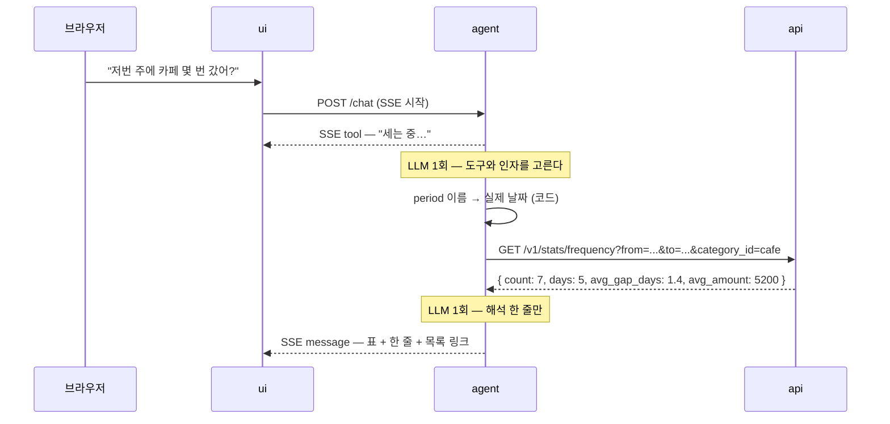

# 대화로 묻는 통계

## 1. 목적

"저번 주에 카페 몇 번 갔지?"

이 질문에 답하려면 지금은 거래 목록으로 가서, 기간을 저번 주로 맞추고, 카테고리를 카페로
걸고, 줄을 센다. 네 동작이다. 그리고 세 번 중 한 번은 "저번 주가 며칠부터였지"에서 막힌다.

대화로 묻는 통계는 이 네 동작을 한 줄로 바꾼다. **묻는 사람은 기간 경계를 모르고,
필터 이름을 몰라도 된다.** 화면을 옮겨 다니는 노동이 이 기능이 없앨 것이다.

기능 1이 답을 카테고리 목록 안에서 골랐다면([category-suggestion-rag.md](category-suggestion-rag.md)),
이 기능은 답을 **도구 조합** 안에서 고른다. 자유도가 한 칸 올라갔다.

---

## 2. 경계 — LLM이 정하는 것과 정하지 않는 것

| | LLM이 정한다 | 코드가 정한다 |
|---|---|---|
| 도구 | 어느 도구를 부를지 | 도구 목록. 질의 모드에는 **읽기 도구만 준다** |
| 기간 | 기간의 **이름** (`last_week`) | 실제 경계 날짜 (5장) |
| 대상 | 카테고리 사전에서 고른 `category_id` | 사전. 사전 밖 값은 거부 |
| 숫자 | 하나도 정하지 않는다 | 건수·합계·평균 전부 `api`가 계산 |
| 문장 | 해석 한 줄 | 숫자가 든 표는 템플릿이 그린다 |

**질의 모드에서 쓰기 도구를 아예 빼는 것**이 이 기능의 하네스 첫 줄이다. "지난달 카페
지출을 보여줘"라고 물었을 때 거래가 지워질 방법이 구조적으로 없어야 한다. 프롬프트로
막지 않고 도구 세트로 막는다.

---

## 3. 질문이 도구 호출이 되는 모양

실제로 이렇게 번역된다. **이 표가 이 문서의 핵심이다.**

| 질문 | 도구 | 인자 |
|---|---|---|
| 저번 주에 카페 몇 번 갔어? | `count_frequency` | `period=last_week`, `category_id=cafe` |
| 이번 달 식비 얼마 썼어? | `summarize_spending` | `period=this_month`, `category_id=food` |
| 지난달보다 식비 늘었어? | `compare_periods` | `a=last_month`, `b=this_month`, `category_id=food` |
| 김밥천국에 올해 얼마 썼어? | `summarize_spending` | `period=this_year`, `merchant=김밥천국` |
| 예산 안에 있어? | `get_budget_status` | `period=this_month` |
| 이번 주에 뭐 샀어? | `search_transactions` | `period=this_week`, `limit=20` |

도구 하나로 끝나는 질문이 대부분이다. 둘을 엮는 질문("식비는 줄었는데 카페는 늘었어?")도
`compare_periods` 두 번이지 새 도구가 아니다.

### 3.1 늘어나는 도구

`count_frequency`가 이 기능 때문에 생긴다. **횟수는 합계와 다른 질문이다.** 지금 있는
`summarize_spending`은 금액을 더하고, 이 도구는 센다. 금액을 받아서 화면이 나누면
같은 계산이 두 군데 생긴다.

| 도구 | 돌려주는 것 |
|---|---|
| `count_frequency` | 건수, 거래가 있던 **날 수**, 평균 간격(일), 회당 평균 금액 |
| `compare_periods` | 두 기간의 카테고리별 합계와 증감(금액·비율) |

건수와 날 수를 같이 내는 이유가 있다. 카페 7건이 5일에 걸쳤는지 하루에 몰렸는지는
전혀 다른 이야기다. 하나만 내면 사용자가 다시 묻게 된다.

도구가 늘면 계약 표에도 줄이 는다 — 늘어날 줄은
[README.md 7장](README.md#7-계약에-늘어나는-것)에 모아 둔다.

---

## 4. 흐름

흐름은 짧은 ReAct다 — "0건인데?"를 보고 다음 수를 바꿔야 하는 자리라서
그렇다([agent-loop.md 4장](agent-loop.md#4-react--기능-2의-흐름)).

LLM 호출은 **두 번**이다. 첫 번째가 도구와 인자를 정하고, 두 번째가 결과를 한 줄로 읽는다.
스텝 상한은 `AGENT_MAX_STEPS`를 그대로 쓰고, 통계 질문이 그 절반을 넘으면 그건 질문이
아니라 탐색이다 — 거기서 끊고 "여기까지 해봤어요"를 낸다.

---

## 5. 기간 — LLM에게 날짜를 계산시키지 않는다

가장 많이 틀리는 자리다. "저번 주"가 며칠부터 며칠까지인지 모델이 계산하면 주의 시작이
일요일이 되기도 하고, 오늘이 포함되기도 하고, 타임존이 UTC가 되기도 한다.
**세 실수 모두 사용자가 알아채지 못한다.** 숫자가 그럴듯하게 나오기 때문이다.

그래서 LLM은 **이름만 고른다.** 경계는 `agent`의 domain 코드가 사용자 타임존으로
계산한다([../development-rules.md 6.1](../development-rules.md#61-시간--저장은-utc-경계는-사용자-타임존)).

| 이름 | 경계 |
|---|---|
| `today` · `yesterday` | 사용자 타임존의 하루 |
| `this_week` | 이번 주 월요일 00:00 ~ 지금 |
| `last_week` | 지난주 월요일 00:00 ~ 일요일 24:00 |
| `this_month` · `last_month` | 달 경계 |
| `this_year` | 1월 1일 ~ 지금 |
| `last_n_days` | `n`일 전 00:00 ~ 지금. `n`은 1~365 |
| `month` | `YYYY-MM`을 같이 받는다 |

주의 시작은 월요일이고, **"저번 주"에 오늘은 들어가지 않는다.** 이런 결정은 문서에
적혀 있어야 한다 — 코드에만 있으면 두 사람이 다르게 기억한다.

날짜를 직접 말한 질문("9월 3일부터 10일까지")만 `range`를 쓴다. 이때도 파싱은 코드가
하고, LLM은 자기가 읽은 날짜 문자열을 그대로 넘긴다.

**답에는 해석한 기간을 늘 밝힌다.** "저번 주(9/14~9/20)에 카페 7번." 이렇게 쓰면
경계를 다르게 생각한 사용자가 바로 알아챈다. 되묻는 것보다 밝히는 게 싸다.

---

## 6. 대상 — 카테고리인가 가맹점인가

"카페"는 카테고리일 수도 있고 가게 이름일 수도 있다. 순서는 이렇다.

1. 카테고리 사전에 있으면 `category_id`로 넘긴다.
2. 없으면 `merchant` 부분 일치로 넘긴다.
3. 둘 다 0건이면 **그때만 되묻는다.** "카페는 카테고리로 없어요. 가맹점 이름인가요?"

사전 밖의 `category_id`는 검증에서 버린다(7장). 기능 1과 같은 규칙이다 —
LLM이 식별자를 지어내는 걸 스키마와 검증으로 막는다.

---

## 7. 검증과 폴백

### 7.1 도구 호출 검증

| 검사 | 걸리면 |
|---|---|
| 도구 이름이 질의 모드 목록에 있나 | 버린다. 쓰기 도구는 애초에 목록에 없다 |
| 인자가 스키마에 맞나 | 한 번 다시 시킨다 |
| `period` 이름이 표에 있나 | 버리고 `this_month`로 간다. 답에 기간을 밝히므로 안전하다 |
| `category_id`가 사전에 있나 | `merchant`로 바꿔 시도한다(6장) |
| `last_n_days`의 `n`이 범위 안인가 | 자른다. 3년치를 세는 질문은 거절한다 |

### 7.2 숫자 검증 — 답변에 있는 숫자가 도구에서 온 것인가

두 번째 LLM 호출은 결과를 읽고 한 줄을 쓴다. 여기서 숫자를 **더하거나 바꿔 쓸** 위험이
있다. "7건, 평균 5,200원"을 보고 "총 36,400원 썼네요"라고 쓰는 식이다. 곱셈이 맞든 틀리든
그 숫자는 DB가 낸 값이 아니다.

그래서 문장을 내보내기 전에 숫자를 대조한다.

- 도구 결과에 있던 수치를 집합으로 모은다(천 단위 구분, 퍼센트 표기를 정규화해서).
- 문장에서 숫자 토큰을 뽑아 그 집합에 있는지 본다. 날짜와 기간 경계는 예외로 둔다.
- 집합 밖 숫자가 있으면 **문장을 버린다.** 표는 그대로 내고, 해석 줄만 생략한다.

완벽한 방어는 아니다. 그래도 "지어낸 합계"라는 가장 흔하고 가장 나쁜 실패를 잡는다.
그리고 이 검사가 있으면 프롬프트에 "계산하지 마"를 적어 두는 것과 달리 **지켜졌는지
확인할 수 있다.**

### 7.3 못 하는 질문

도구로 표현할 수 없는 질문은 못 한다고 말한다. 비슷한 숫자로 얼버무리지 않는다.

| 질문 | 왜 못 하나 | 뭐라고 하나 |
|---|---|---|
| 왜 이렇게 많이 썼어? | 인과는 데이터에 없다 | 늘어난 카테고리 셋을 보여주고 판단은 넘긴다 |
| 다음 달 얼마 쓸 것 같아? | 예측 모델이 없다 | 지금 페이스로 환산한 값만 낸다 |
| 남들은 식비에 얼마 써? | 다른 사용자의 데이터가 없다 | 못 한다고 말한다 |
| 이 지출 합리적이야? | 판단 기준이 없다 | 예산 대비 비율만 낸다 |

### 7.4 폴백

| 상황 | 화면 |
|---|---|
| LLM 장애·타임아웃 | "지금은 답할 수 없어요" + [거래 목록](../../ui_docs/pages/transactions.md) 링크 |
| 스텝·비용 상한 | "여기까지 해봤어요" + 지금까지의 답 |
| 도구가 0건 | "저번 주에는 카페 기록이 없어요" — 0은 오류가 아니다 |
| 숫자 검증 실패 | 표만. 해석 줄 없이 |

0건을 제대로 말하는 건 생각보다 중요하다. "기록이 없다"와 "못 찾았다"는 다른 말이고,
사용자는 전자에서 "아, 카드로 안 긋고 현금으로 썼구나"를 떠올린다.

---

## 8. 화면

[채팅 화면](../../ui_docs/pages/chat.md)을 그대로 쓴다. **SSE 이벤트를 새로 만들지 않는다.**

- 진행 줄은 기존 `tool` 이벤트로 낸다 — "세는 중…", "합계를 내는 중…".
- 결과 표와 해석 줄은 `message` 이벤트 하나에 담는다. 통계 전용 이벤트를 만들면
  이벤트 표가 늘고, 화면 코드에 분기가 하나 더 생기고, 그 분기는 통계 질문에만 쓰인다.
- 답 끝에 목록 링크를 붙인다 — `/transactions?from=…&to=…&category_id=cafe`.
  숫자를 의심하는 사용자가 원본으로 갈 수 있는 길이 있어야 한다.

이벤트 표는 [chat.md 4.1](../../ui_docs/pages/chat.md#41-sse-이벤트가-화면으로)이 정본이다.
거기 줄이 늘지 않는 게 이 기능의 목표 중 하나다.

### 8.1 "알림"은 물었을 때만 온다

기록 직후 예산 페이스를 한 줄 덧붙이는 것([../../README.md](../../README.md) 5장)까지가
지금 범위다. **주기적으로 밀어 주는 알림은 만들지 않는다.** 스케줄러도 푸시 경로도 없고,
읽지 않을 알림을 만들려면 LLM을 사람 없이 돌려야 한다 —
지금 하지 않기로 한 것이다([README.md 8장](README.md#8-이-폴더가-하지-않는-것)).

---

## 9. 평가

고정 세트는 `tests/fixtures/ai/questions.json`. 질문 30개에 정답 도구·인자를 라벨로 붙인다.

| 묶음 | 건수 | 보는 것 |
|---|---|---|
| 한 도구로 끝나는 질문 | 15 | 도구·인자가 라벨과 같은가 |
| 기간 표현 | 8 | `저번 주` · `지난달` · `최근 3일` · `9월` |
| 도구 둘을 엮는 질문 | 4 | 호출 순서는 안 본다. 결과 숫자만 본다 |
| 거절해야 하는 질문 | 3 | 예측·인과·비교. **못 한다고 말했는가** |

| 지표 | 목표 |
|---|---|
| 도구 선택 정확도 | 라벨과 일치 |
| 기간 해석 정확도 | 100%. 여기가 틀리면 숫자는 전부 틀린다 |
| 숫자 일치율 | 100%. 도구 결과에 없는 숫자가 답에 있으면 실패 |
| 거절률 | 거절해야 할 3건에서 3건 |
| 건당 LLM 호출 | 2회 |

기간 해석에만 100%를 요구하는 이유는, 다른 실수는 사용자가 보면 알지만 이건 모르기
때문이다. 틀린 기간의 정확한 합계는 정확해 보인다.

---

## 10. 결정과 이유

- **왜 SQL을 생성하지 않나.** text-to-SQL이면 도구를 늘리지 않고 아무 질문에나 답할 수
  있다. 대신 읽기 전용을 보장하는 일, 3년치를 긁는 질의를 막는 일, 결과를 캐시하는 일,
  그리고 "왜 이 숫자가 나왔나"를 설명하는 일이 전부 어려워진다. 도구는 좁지만 **그 좁음이
  계약**이다. 계약이 있으면 평가할 수 있다.
- **왜 기간을 코드가 계산하나.** 5장. 틀려도 사용자가 알 수 없는 유일한 자리라서다.
- **왜 되묻기를 줄이나.** 되물으면 왕복이 늘고, 사용자는 "그냥 화면에서 볼까"로 돌아간다.
  기본값을 쓰고 **가정을 밝히는 쪽**이 대화를 짧게 만든다. 0건일 때만 되묻는다.
- **왜 해석 줄을 LLM에게 맡기나.** 숫자만 내면 사용자가 비교를 직접 해야 한다. 한 줄이
  붙으면 읽고 끝난다. 대신 그 한 줄이 숫자를 지어낼 수 있어서 7.2의 검사가 붙었다.
- **왜 도구 결과를 캐시하지 않나.** 같은 질문을 두 번 하는 일이 드물고, 기록이 방금
  바뀌었을 수 있다. 리포트처럼 한 번에 여러 집계를 내는 쪽은 캐시한다([agentic-reports.md 8장](agentic-reports.md#8-캐시--시간이-아니라-버전으로)).

---

## 11. 하지 않는 것

- **예측과 인과.** "다음 달 얼마", "왜 늘었나". 페이스 환산과 증감 제시까지가 데이터가
  받쳐 주는 한계다.
- **text-to-SQL.** 10장.
- **주기 알림·푸시.** 8.1.
- **대화 기록 검색.** 찾는 건 [거래 목록](../../ui_docs/pages/transactions.md)에서 한다.
- **차트.** 대화에서는 숫자와 표까지다. 그림은 리포트 쪽 일이다.
- **여러 사용자 비교.** 데이터가 없다.
