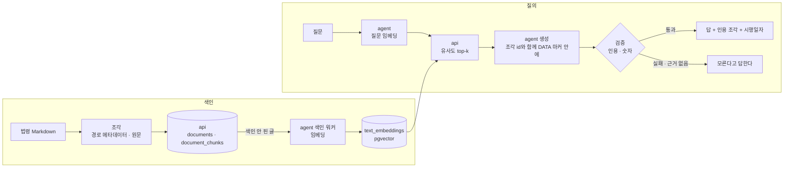

# 문서 Q&A — 법령을 근거로 답한다

## 1. 목적

"카드값이 많이 나왔는데 연말정산에서 얼마나 돌려받지?"

가계부를 보다 보면 숫자 너머의 질문이 생긴다. 이걸 지금 풀려면 법령 검색창에 낱말을
넣고, 조문을 찾고, 항과 호를 끝까지 읽는다. 그리고 대개 첫 단계에서 막힌다 — 사람은
"카드값 공제"라고 묻는데 법은 "신용카드등사용금액에 대한 소득공제"라고 적는다.

문서 Q&A는 그 조문을 찾아 **인용한 문장으로** 답한다. 답 아래에는 어느 법 몇 조 몇 항에서
왔는지와 시행일자가 붙는다. 문서에 근거가 없으면 모른다고 답한다.

목적이 하나 더 있다. **전통적인 RAG를 처음부터 끝까지 한 번 만든다**(이슈 #11). 청킹 →
임베딩 → 검색 → 근거를 인용한 생성을 단계마다 따로 만들고 따로 재서, 어느 선택이 답의
품질을 바꾸는지 눈으로 확인한다.

기능 1·2와 다른 점은 답의 재료다. 거기서는 숫자를 DB가 냈다면([README.md 2장](README.md#2-모든-ai-기능에-걸리는-원칙)
원칙 1), 여기서는 **문장을 문서가 낸다.** 답의 주장은 인용한 조각 안에 있어야 한다.

---

## 2. 경계 — LLM이 정하는 것과 정하지 않는 것

| | LLM이 정한다 | 코드가 정한다 |
|---|---|---|
| 조각 | 하나도 정하지 않는다 | 조·항·호 구조와 길이 상한으로 자른다 |
| 검색 | 하나도 정하지 않는다 | 질문 임베딩, 유사도 top-k |
| 인용 | 넘겨준 조각 중 어느 것이 근거인지 | 인용이 넘겨준 조각 안에 있나 |
| 출처 | 쓰지 않는다 | 법령명·조·항 경로와 시행일자를 조각의 메타데이터에서 |
| 숫자 | 문서의 숫자를 옮겨 말한다 | 답의 숫자가 인용 조각에 있나 |
| 답 없음 | abstain 표시 | 인용이 없거나 검증에 걸리면 abstain으로 바꾼다 |

서비스 경계는 [README.md 3장](README.md#3-공통-골격) 그대로다.

| 서비스 | 하는 일 |
|---|---|
| `api` | 문서·조각 저장, 벡터 검색. LLM 키를 모른다 |
| `agent` | 임베딩, 생성, 인용 검증. 키는 여기만 있다 |
| `ui` | 질문과 답, 인용 조각과 시행일자 표시. LLM을 모른다 |

- **문서 안의 문장은 데이터다**(원칙 5). 조각은 DATA 마커 안에 넣는다. 법령에 지시문이 들어 있을
  일은 없지만, 같은 길로 나중에 사용자의 문서가 들어온다.
- **계산하지 않는다**(원칙 1). 조문의 "100분의 40"을 옮겨 말하는 것까지다. "내 공제액은 얼마인가"는
  이 기능이 아니다(9장).
- **법률 자문이 아니다.** 답 아래에 "조문을 옮긴 것이고 법률 자문이 아니다"와 시행일자를 늘 붙인다.
  조문이 바뀌면 답도 바뀐다.

---

## 3. 자료 — 법령 아홉 조문

가계부와 붙어 있는 조문만 받는다. 카드 소득공제, 카드 분실·도난 책임, 가맹점이 지킬 것, 할부 철회와
항변권, 전자금융 오류와 사고 책임이다.

| 법령 | 조문 | 파일 |
|---|---|---|
| 조세특례제한법 | 제126조의2 신용카드 등 사용금액에 대한 소득공제 | `tax-incentives-act.md` |
| 조세특례제한법 시행령 | 제121조의2 신용카드등 사용금액에 대한 소득공제 | `tax-incentives-decree.md` |
| 소득세법 | 제59조의4 특별세액공제 | `income-tax-act.md` |
| 여신전문금융업법 | 제16조 신용카드회원등에 대한 책임, 제19조 가맹점의 준수사항 | `credit-finance-act.md` |
| 할부거래에 관한 법률 | 제8조 청약의 철회, 제16조 소비자의 항변권 | `installment-transactions-act.md` |
| 전자금융거래법 | 제8조 오류의 정정 등, 제9조 금융회사 또는 전자금융업자의 책임 | `electronic-financial-transactions-act.md` |

- 자리는 `tests/fixtures/ai/documents/laws/`, 법령 하나에 Markdown 하나, 조 하나에 `##` 제목 하나.
  파일 머리에 출처·법령일련번호·시행일자가 있다.
- 받는 길은 `scripts/fetch_laws.py` 하나다. 국가법령정보센터 Open API의 기관 코드를 `LAW_API_OC`로
  받는다. 조문의 글은 고치지 않는다 — 항은 문단, 호·목은 목록 항목으로 옮길 뿐이다.
- 다시 받으면 시행일자와 법령일련번호가 바뀔 수 있다. 그때는 정답 세트(6장)를 다시 맞춘다.

### 3.1 잰 것

`python3 scripts/fetch_laws.py --measure` — 항 하나는 항 문단과 딸린 호·목이다.

| | 값 |
|---|---|
| 조 · 항 · 호목 | 9 · 77 · 127 |
| 항 길이(글자) | 최소 37 · 중앙 175 · p90 544 · 최대 2951 · 평균 310 |
| 분포 | 0~99자 23 · 100~199자 18 · 200~399자 21 · 400~799자 9 · 800~1599자 3 · 1600자~ 3 |
| 개정 꼬리표 | 58개, 항 글자의 8.6% |
| 본문 | 24,326자 |

이 숫자가 청킹을 정하는 재료다(7장).

- **분포가 한쪽으로 길다.** 항 셋 중 둘이 200자 아래인데, 가장 긴 셋 — 조특법 제126조의2 ②(2951자),
  소득세법 제59조의4 ③(1934자), 시행령 제121조의2 ⑥(1612자) — 이 호·목을 수십 개 품는다.
  항 하나를 조각 하나로 두면 이 셋이 어떤 상한이든 넘는다.
- **조각 홀로는 무엇에 관한 것인지 모른다.** "제1항제1호ㆍ제2호 및 제4호의 금액의 합계액",
  "같은 법 제20조제2항" 같은 참조와 "신용카드등사용금액" 같은 정의어가 많다. 앞 항을 모르면 읽히지 않는다.
- **개정 꼬리표가 많다.** `<개정 2011.12.31, 2014.12.23, …>`처럼 한 항에 날짜가 열일곱 개 붙기도 한다.
  검색에는 잡음이고, 화면의 인용에는 원문이다.
- **⑮ 다음 항은 `<16>`으로 적힌다.** 꼬리표처럼 생겼지만 항 번호다. 꼬리표를 지우는 규칙이 이것을
  지우면 항 번호가 사라진다 — 꼬리표는 날짜가 있어야 꼬리표다.

---

## 4. 흐름



흐름은 **단발**이다 — 검색 한 번, 생성 한 번. 다음에 무엇을 볼지가 방금 본 것에 달리지 않는다
([agent-loop.md 2장](agent-loop.md#2-흐름-셋)의 판정). LLM 호출은 질문 임베딩 한 번과 생성 한 번이다.

임베딩은 [기능 1](category-suggestion-rag.md#43-누가-벡터를-채우나)과 같은 길로 채운다. `api`는
`agent`를 부르지 않고, `agent`가 색인 안 된 글을 당겨 가 임베딩해 돌려준다.

---

## 5. 입력·출력과 검증·폴백

### 5.1 조각

| 칸 | 내용 |
|---|---|
| `chunk_id` | 조각의 id. 청킹 설정이 바뀌면 바뀐다 |
| `document_id` | 법령 하나 |
| `path` | 법령명 · 조 · 항 · 호 — 예: `조세특례제한법 › 제126조의2 › ② › 2.` |
| `text` | 원문. 화면의 인용은 이것을 그대로 보인다 |
| `embed_text` | 임베딩할 글. 맥락 머리·꼬리표를 어떻게 할지는 7장에서 잰다 |
| `position` | 문서 안의 순서 |

시행일자와 출처는 문서에 붙어 있고, 조각은 문서를 따라간다.

### 5.2 LLM에게 주고 받는 것

주는 것 — 질문과 조각 k개. 조각마다 id와 경로를 붙이고, 질문과 조각 글은 DATA 마커 안에 넣는다.

받는 것 — 스키마 하나다(원칙 3).

```json
{ "answer": "버스·지하철 요금은 카드로 낸 금액의 100분의 40을 공제합니다.",
  "citations": ["c41"],
  "abstain": false }
```

### 5.3 검증

| 검사 | 걸리면 |
|---|---|
| 스키마에 맞나 | 한 번 다시 시킨다. 또 틀리면 폴백 |
| `citations`가 넘겨준 조각 id의 부분집합인가 | 지어낸 인용이다. 답을 버리고 abstain |
| `abstain`이 아닌데 인용이 없나 | 근거 없는 주장이다. abstain |
| 답의 숫자가 인용 조각의 숫자 안에 있나 | 답을 버리고 인용 조각의 원문만 보인다 |

숫자 검사는 기능 2와 같은 식이다([chat-analytics.md 7.2](chat-analytics.md#72-숫자-검증--답변에-있는-숫자가-도구에서-온-것인가)).
집합만 다르다 — 도구 결과가 아니라 인용한 조각의 글이다. "100분의 40"을 "40%"로 말하는 것은 통과하고,
"공제율이 40%니 10만 원이면 4만 원"은 걸린다.

출처 줄(법령명·조·항·시행일자)은 모델이 쓰지 않는다. 코드가 인용 id로 조각의 메타데이터를 찾아 붙인다.
모델이 조 번호를 지어낼 길이 없다.

### 5.4 폴백

| 상황 | 화면 |
|---|---|
| 임베딩 제공자 장애 | "지금은 찾아볼 수 없어요" — 검색이 없으면 답도 없다 |
| 생성 LLM 장애·타임아웃 | 검색된 조각의 원문을 그대로 보인다. 찾기는 됐다 |
| 상위 조각의 유사도가 임계값 아래 | "이 문서들에는 근거가 없어요" |
| 검증 실패 | 위 표대로 abstain이나 원문만 |

원칙 8 그대로다. 생성이 죽어도 검색은 산다 — 사람은 조문을 직접 읽으면 된다.

---

## 6. 평가

고정 세트는 `tests/fixtures/ai/document_qa.json`. 질문마다 정답 조각의 **경로**를 라벨로 단다(7.1).

### 6.1 시드 — 열세 건

지금은 시드다. 답이 있는 질문 10, 답이 없거나 일부만 있는 질문 3. `doc-index`에서 30건과 답 없는
질문 5건으로 늘린다(이슈 #11).

| 묶음 | 건수 | 맞는 답 |
|---|---|---|
| `answer` | 10 | 정답 경로를 인용해 답한다 |
| `partial` | 2 | 있는 만큼 답하고, 나머지는 문서에 없다고 말한다 |
| `none` | 1 | 모른다고 답한다 |

- 정답은 `{"law", "article", "paragraph", "item", "subitem"}` 경로다. 항 번호는 숫자로 — ①은 1,
  `<16>`은 16.
- 질문은 조문의 낱말로 쓰지 않는다. 가계부를 보던 사람의 말이다 — "헬스장 회비", "관리비", "링크를
  눌렀다가". 조문에는 "체력단련장", "아파트관리비", "부정한 방법으로 획득한 접근매체"라고 적혀 있다.
  이 거리를 검색이 메우는지가 재는 대상이다.
- 여섯 법령이 다 한 번 이상 정답에 나온다. `<16>` 항(시행령의 체육시설)과 호·목 깊이(조특법 ② 3호
  다목)를 일부러 넣었다.
- 일부만 있는 질문은 둘 다 실제로 자주 나올 모양이다 — 조문이 원칙만 말하고 사례 판단은 안 하는 것
  (피싱 피해), 둘 중 하나만 조문에 있는 것(관리비와 구독료).

| 단계 | 지표 | 보는 것 |
|---|---|---|
| 검색 | recall@k, MRR@k | 정답 경로를 품은 조각이 top-k 안에 있나, 몇 번째인가 |
| 생성 | 근거 충실도 | 답의 주장이 인용 조각에 있나 — 숫자 검증 통과율과 사람의 표본 확인 |
| 생성 | abstain율 | 답이 없는 질문에서 모른다고 했나 |
| 생성 | 오거절률 | 답이 있는 질문에서 모른다고 했나 |
| 기준선 | 위 생성 지표 | 검색 없이 LLM에게만 물은 답 |

- 검색 평가는 임베딩만 부른다. 청킹 설정마다 표 한 줄을 남긴다(7.2). 이 표가 이 기능의 핵심 학습 결과다.
- 실제 모델을 부르는 평가는 `-m integration`이다. 단위 테스트는 가짜 임베더와 고정 응답만 쓴다.
- 조각이 정답 경로를 "품는다"는 것은 조각의 경로가 정답 경로와 같거나 그 위(조나 항)라는 뜻이다.
  항 하나를 둘로 나눴다면 정답 호를 담은 쪽만 맞다.

---

## 7. 결정과 이유

### 7.1 지금 정하는 것

- **자료는 법령이다 — 이슈 #11의 "가상 문서"를 뒤집는다.**
  - 우리가 쓴 문서는 우리가 낼 질문의 낱말로 쓰인다. 검색이 쉬워 보이고, 잰 숫자가 실제를 말하지 않는다.
    법령은 사람의 말("카드값 공제")과 조문의 말("신용카드등사용금액")이 멀다. 검색이 실제로 풀어야 하는
    거리가 거기 있다.
  - 실제 문서의 어려움이 다 있다 — 2951자짜리 항, 호·목 중첩, 다른 조·항을 가리키는 참조, 항 글자의
    8.6%인 개정 꼬리표, ⑮ 다음의 `<16>`(3.1). 가상 문서를 쓰면 이런 것을 넣는 걸 잊는다.
  - 이슈가 가상 문서를 고른 이유는 저작권이었다. 법령은 보호받지 않는 저작물이다(저작권법 제7조).
  - 구조가 정해져 있어서 정답을 경로로 적을 수 있다(다음 줄).
  - 가계부와 붙어 있다 — 카드 소득공제, 카드 분실 책임, 할부 철회, 전자금융 오류.
  - 잃는 것: 카드 혜택 안내의 "업종별 할인율 표" 같은 표가 없다. 표 청킹은 이 자료로 배우지 못한다(9장).
- **정답은 조각 id가 아니라 경로로 적는다** — 법령·조·항·호. 조각 id는 청킹 설정이 바뀔 때마다 바뀐다.
  id로 라벨을 달면 설정마다 정답 세트를 다시 만들어야 하고, 그러면 설정끼리 견줄 수 없다. 이슈의
  "정답 조각 id"를 이렇게 바꾼다.
- **원문은 고치지 않고 저장한다.** 꼬리표·참조를 손대는 것은 임베딩할 글(`embed_text`)에서만 한다.
  화면의 인용은 원문이다 — 사용자가 법령 사이트에서 찾아도 같은 글이어야 한다.
- **출처는 코드가 적는다.** 모델은 조각 id만 낸다(5.3).
- **흐름은 단발이다.** 질문 분해나 다시 찾기 루프는 두지 않는다. 검색이 놓친 것을 루프로 메우면
  어느 단계가 품질을 바꿨는지 보이지 않는다 — 이 기능의 학습 목적과 어긋난다.
- **임베딩은 기능 1과 같이 쓴다** — 같은 `EMBEDDING_MODEL`과 차원, 같은 `text_embeddings` 표와
  색인 워커. 조각의 `embed_text`도 해시로 같은 표에 들어간다. 워커가 둘이 되지 않고, 모델을 바꾸면
  두 기능이 같이 다시 색인된다.
- **어디서 묻나 — 별도 화면이 먼저, 채팅 도구가 나중이다.** 화면에서는 검색된 조각과 점수, 인용이
  단계마다 보인다. 채팅의 `search_documents` 도구는 마지막 feature에서 붙인다(8장). 이슈의 "정할 것"에
  대한 답이다.
- **올리기는 뒤로 미룬다.** 화면에서 문서를 올리는 것은 이번 범위에서 뺀다. 저장 api는 Markdown을
  받는 모양으로 만들고, 법령도 그 길로 넣는다. 이슈 완료 조건의 "문서 올리기"를 이렇게 바꾼다.

### 7.2 재서 정하는 것

한 번에 하나씩 정한다. 앞에서 고른 값을 고정하고 다음을 잰다. 표의 순서가 재는 순서다.

| 무엇 | 후보 | 지표 | 고르는 기준 |
|---|---|---|---|
| 청킹 단위 | 조 · 항(호·목 포함) · 항이되 상한을 넘으면 호 경계에서 나눔 · 고정 길이(기준선) | recall@5, MRR@5 | recall@5가 가장 높은 것. 2%p 안이면 평균 조각이 짧은 쪽 — 생성 프롬프트가 싸다 |
| 길이 상한 `CHUNK_SIZE` | 400 · 600 · 800자 | recall@5, 조각 수 | 위와 같다. 후보는 항 p90(544자) 근처에서 골랐다 |
| 겹침 `CHUNK_OVERLAP` | 0 · 앞 호 하나 · 100자 | recall@5 | 0보다 2%p 넘게 올라야 둔다 |
| 맥락 머리 | 없음 · "법령명 제X조(제목)" · 여기에 항 번호까지 | recall@5, MRR@5 | 오르면 붙인다. 참조·정의어 때문에 조각 홀로는 무엇에 관한 것인지 모른다는 가설(3.1)을 잰다 |
| 개정 꼬리표 | 임베딩할 글에 둔다 · 뺀다 | recall@5 | 빼서 떨어지지 않으면 뺀다 |
| `DOC_TOP_K` | 3 · 5 · 8 | recall@k, 프롬프트 글자 수, 근거 충실도 | recall@k가 0.9를 넘는 가장 작은 k |
| 하이브리드(BM25 결합) | 없음 · 있음 | recall@5, MRR@5 | recall@5가 5%p 이상 올라야 붙인다. 형태소 분석 없이 한국어 BM25가 쓸모 있는지가 질문이다 |
| 재랭킹(LLM) | 없음 · 있음 | MRR@5, p95 지연, 건당 비용 | MRR이 오르고 p95 지연이 3초 안일 때만 |
| abstain 임계값 `DOC_MIN_SIMILARITY` | 상위 조각 유사도 0.5 · 0.6 · 0.7 | 답 없는 질문의 abstain율, 답 있는 질문의 오거절률 | 오거절률 10% 안에서 abstain율이 가장 높은 값 |

기준선은 둘이다. 검색은 고정 길이 청킹, 생성은 검색 없이 LLM에게만 물은 답. 둘보다 나아지지 않는
단계는 붙이지 않는다.

---

## 8. 만드는 순서

feature 넷이다. 앞의 것이 뒤의 것의 재료가 되고, **생성 LLM은 셋째부터 들어온다.**

| # | feature | 서비스 | 내용 | 모델 |
|---|---|---|---|---|
| 1 | `doc-store` | `api` + `db` | `documents`·`document_chunks` 테이블과 마이그레이션. Markdown → 조각(경로 메타데이터, 원문 보존)을 청킹 설정마다 만든다. 문서 넣기·목록·조각 조회(`POST /v1/documents`, `GET /v1/documents`, `GET /v1/documents/{id}/chunks`). 법령 아홉 조문을 넣는 명령. 청킹 단위 테스트 — 경로, `<16>`, 꼬리표 | 없음 |
| 2 | `doc-index` | `agent` + `api` | 조각의 `embed_text`를 `text_embeddings`에 — 색인 워커가 문서 조각도 당겨 간다. 질문 벡터로 top-k 조각을 내는 검색(`POST /v1/documents/search`). 검색 평가(recall@k·MRR, 설정별 표) — 7.2의 청킹·`DOC_TOP_K`·하이브리드를 여기서 정한다 | 임베딩만 |
| 3 | `doc-qa` | `agent` + `ui` | 단발 생성, 인용·숫자 검증, abstain — `agent`의 `POST /ask`. 질문 화면 — 답, 인용 조각, 점수, 시행일자, 고지. 생성 평가(근거 충실도, abstain율, 기준선). 7.2의 재랭킹·임계값을 여기서 정한다 | 생성 |
| 4 | `doc-tool` | `agent` | `search_documents` 읽기 도구를 query 모드에. 모드별 스키마 스냅샷이 바뀐다. 대화 통계 평가 세트에 문서 질문을 몇 건 더한다 | 없음(기존 루프) |

- 청킹 설정은 `doc-store`에서 여럿을 만들 수 있게 한다. 무엇을 쓸지는 `doc-index`의 평가가 정한다.
  설정 하나만 만들면 견줄 수 없다.
- 각 feature가 붙을 때 계약(엔드포인트·테이블·환경변수)을 옮긴다. 아직 옮기지 않은 줄은
  [README.md 7장](README.md#7-계약에-늘어나는-것)에 있다.

---

## 9. 하지 않는 것

- **계산.** "내 공제액은 얼마인가", "이번 달 받은 할인 총액" — 문서와 거래를 엮는 계산은 범위 밖이다.
  조문의 숫자를 옮겨 말하는 것까지다.
- **법률 해석.** 판례·유권해석·여러 조문을 엮은 판단은 하지 않는다. 조문을 찾아 옮긴다.
- **PDF·이미지 OCR.** Markdown부터 한다.
- **표.** 카드 혜택 안내 같은 표가 있는 문서는 표 청킹을 정할 때 가상 문서로 더한다. 법령 자료에는 표가 없다.
- **화면에서 올리기.** 이번에는 받아 둔 법령만 넣는다(7.1).
- **개정 감시.** 법령이 바뀌어도 저절로 다시 받지 않는다. 사람이 스크립트를 돌리고 정답 세트를 맞춘다.
- **별도 벡터 DB.** pgvector로 한다([README.md 8장](README.md#8-이-폴더가-하지-않는-것)).
