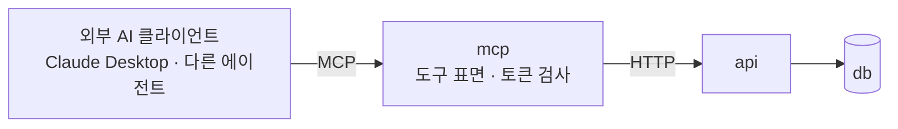

# MCP — 외부 AI 서비스가 들어오는 통로

## 1. 목적

우리 화면과 우리 에이전트를 거치지 않고 **다른 AI 서비스가 이 가계부에 닿는 길**이다.
Claude Desktop에서 "이번 달 식비 얼마 썼어?"를 묻거나, 다른 에이전트가 월말 정산을 하면서
우리 집계를 한 번 부르는 식이다.

MCP(Model Context Protocol)는 그 통로의 표준이다. 도구·리소스를 프로토콜로 노출하면
클라이언트마다 따로 붙일 게 없어진다. 우리가 얻는 것은 하나다 — **도구를 이미 정의해
놓았으니, 표면을 하나 더 열면 새 클라이언트가 공짜로 붙는다**([tools.md](tools.md)).

잃을 수 있는 것도 하나다. 켜는 순간 금액과 가맹점이 남의 모델 컨텍스트로 나간다.
그래서 이 문서의 절반은 **기본값을 끈 상태로 두는 이야기**다(7장).

---

## 2. 어디에 두나 — 서비스 하나를 더 세운다

`mcp`는 다섯 번째 서비스다. **얇은 어댑터이고, 판단이 없다.**



| 서비스 | LLM 키 | DB | 프롬프트 | 외부 공개 |
|---|---|---|---|---|
| `ui` | 없다 | 없다 | 없다 | 한다 |
| `agent` | **있다** | 없다 | 있다 | 안 한다 |
| `api` | 없다 | **있다** | 없다 | 안 한다 |
| `mcp` | 없다 | 없다 | 없다 | 선택 — 기본은 로컬만 |

대안 둘을 검토하고 기각했다.

- **`api`에 MCP 라우터를 붙인다.** 도메인 서버가 프로토콜 둘을 말하게 된다. 그리고 "외부에
  열어도 되는 것"과 "내부 전용"이 한 서비스 안에서 섞인다. 외부 표면은 따로 있는 게 낫다 —
  좁게 고르는 일이 설계이기 때문이다.
- **`agent`에 붙인다.** 외부 클라이언트는 **자기 모델을 들고 온다.** 우리 루프도 프롬프트도
  비용 상한도 필요 없다. 붙이면 LLM 키를 가진 서비스를 외부에 노출하는 셈이 된다.

`mcp`가 하는 일은 셋뿐이다 — 토큰을 검사하고, 도구 스키마를 프로토콜 모양으로 내놓고,
호출을 `api`로 옮긴다. 도구 정의는 복사하지 않고 `agent`와 같은 스키마 모듈을
쓴다... 고 하면 서비스끼리 import하는
것이 된다([../development-rules.md 2.3](../development-rules.md#23-서비스끼리-import하지-않는다)).
스키마는 `src/shared`에 도메인 지식 없는 형태로 두고 양쪽이 각자 조립한다.

---

## 3. 무엇을 노출하나

### 3.1 도구

[tools.md 6장](tools.md#6-자리마다-도구를-좁힌다)의 `mcp` 모드가 그대로 목록이 된다.
새 도구를 만들지 않는다.

| 분류 | 도구 | 기본 |
|---|---|---|
| 집계 | `summarize_spending`, `compare_periods`, `count_frequency`, `get_budget_status` | **켜짐** |
| 개별 거래 | `search_transactions`, `detect_outliers` | 꺼짐 |
| 분류 | `suggest_category` | 꺼짐 |
| 쓰기 | `propose_transaction` | 꺼짐 |

기본값이 집계까지인 이유는 7.2에 있다. 합계는 "9월 식비 412,000원"이고, 개별 거래는
"9월 3일 22시 어느 가게에서 얼마"다. 나가는 정보의 종류가 다르다.

### 3.2 리소스

목록과 사전은 도구가 아니라 리소스로 낸다. 클라이언트가 캐시할 수 있고, 호출로 세지 않는다.

| 리소스 | 내용 |
|---|---|
| `account-book://categories` | 카테고리 사전 (id, 이름, 부모) |
| `account-book://budgets/current` | 이번 달 예산 설정 |
| `account-book://schema` | 도구가 쓰는 기간 이름 목록과 통화 단위 |

`schema`를 내주는 이유는, 외부 모델이 `period`에 `"저번 주"`를 넣어 보내는 실패가 가장
흔하기 때문이다. 기간 이름 목록은 우리 쪽 규약이고, 알려주면 한 번에
맞춘다([chat-analytics.md 5장](chat-analytics.md#5-기간--llm에게-날짜를-계산시키지-않는다)).

**거래 전체를 리소스로 내놓지 않는다.** 클라이언트가 한 번에 읽어 가는 덤프는 상한도
감사도 의미가 없어진다.

---

## 4. 쓰기 — 제안까지만 간다

외부 클라이언트에는 **우리 확인 카드가 없다.** 사용자가 무엇을 승인했는지 우리가 알 방법이
없고, 클라이언트가 "사용자가 확인했다"고 주장하는 걸 검증할 수도
없다([../api-contract.md 4장](../api-contract.md#4-확인이-필요한-쓰기)의 한계가 여기서 그대로 문제가 된다).

그래서 MCP 쓰기는 한 단계 앞에서 멈춘다.

```
외부 클라이언트  →  propose_transaction(...)   → 제안 한 건이 생긴다. DB의 거래는 그대로.
사용자           →  우리 ui에서 확인 카드를 본다 → 확인하면 그때 기록된다.
```

| 무엇 | MCP에서 |
|---|---|
| 거래 기록 | 제안만. 실행은 사용자가 우리 화면에서 |
| 거래 수정·삭제 | **없다.** 제안으로도 열지 않는다 |
| 예산 설정 | 없다 |
| `X-Confirmed-By` | `mcp`는 붙이지 않는다. 붙일 권한이 없다 |

- 제안은 `ui` 상단에 배지로 뜬다 — "밖에서 온 제안 2건". 어디서 왔는지(클라이언트 이름)를
  카드에 적는다.
- 제안 수명은 24시간이다. 멱등 키 보존 기간과 같게
  맞춘다([agent-loop.md 6장](agent-loop.md#6-사람이-끼는-자리)).
- 제안도 `tool_calls`에 남고, 거래가 만들어지면 `source`는 `agent`가 아니라 `mcp`다.
  "이 거래는 어디서 왔지"에 답할 수 있어야 한다.

수정·삭제를 제안으로도 열지 않은 이유는 비대칭이다. 잘못 들어온 제안은 사용자가 무시하면
끝이지만, 삭제 제안은 사용자가 잘못 확인하면 되돌릴 게 없다.

---

## 5. 신원과 권한

인증이 아직 없는 저장소다([../api-contract.md 2장](../api-contract.md#2-헤더--누가-무엇을-대신하는가)).
그래서 MCP는 **자기 문 앞에서만** 신원을 본다.

| 무엇 | 어떻게 |
|---|---|
| 토큰 | `MCP_TOKEN`. 없으면 서버가 뜨지 않는다 |
| 사용자 | 토큰 하나가 사용자 하나에 고정 매핑. `X-User-Id`를 클라이언트가 말하지 않는다 |
| 범위 | `read` · `propose` 둘. 기본 `read` |
| 도구 목록 | `MCP_ALLOWED_TOOLS`. 목록에 없는 도구는 **목록 응답에도 안 나온다** |
| 회수 | 토큰을 바꾸면 끝난다. 세션도 같이 끊는다 |

- 허용되지 않은 도구는 "권한이 없다"가 아니라 **아예 없는 것으로** 보인다. 있다는 걸
  알려주면 그때부터 클라이언트 모델이 그걸 부르려고 한다.
- 범위를 벗어난 호출은 `403 permission_denied`로 내려온 `api` 응답을 그대로 번역한다.
  판단은 여기서도 `api`가 한다.
- 분당 호출 상한을 둔다. 넘으면 429(Too Many Requests)로 끊고, 재시도 간격을 응답에 적는다.
  루프에 빠진 외부 에이전트가 우리 DB를 두드리는 걸 막는 건 우리 몫이다.

다중 사용자로 가면 토큰은 OAuth로 바뀐다. 그때까지 **`mcp`를 인증 없이 열지 않는다.**

---

## 6. 전송과 켜는 법

| 전송 | 언제 | 노출 |
|---|---|---|
| stdio | 같은 기계에서 쓸 때. 기본 | 없음. 클라이언트가 프로세스를 띄운다 |
| streamable HTTP | 다른 기계·다른 서비스에서 쓸 때 | compose 내부. 호스트로 여는 건 사용자가 직접 |

```
MCP_ENABLED=false          # 기본. 켜는 것은 사용자의 결정이다
MCP_TRANSPORT=stdio
MCP_TOKEN=                 # 시크릿. 비면 뜨지 않는다
MCP_ALLOWED_TOOLS=summarize_spending,compare_periods,count_frequency,get_budget_status
```

`MCP_ENABLED=false`가 기본인 것이 이 문서의 결론이다. 있으면 좋은 통로이지만,
**모르고 열려 있으면 안 되는 통로**다.

stdio를 기본으로 둔 이유는 노출 표면이 0이기 때문이다. 클라이언트가 우리 컨테이너 안에서
프로세스를 띄우고 파이프로 말한다. 네트워크에 뜨는 포트가 없으면 포트를 잘못 여는 실수도 없다.

---

## 7. 하네스

### 7.1 들어오는 것

- **인자는 스키마로 검증한다.** 외부 클라이언트의 모델은 우리가 프롬프트를 못 고치는
  모델이다. 검증이 유일한 방어선이다.
- 결과 상한은 [tools.md 3.2](tools.md#32-크기-상한)를 그대로 쓴다. 외부라고 더 주지 않는다.
- 도구 오류는 프로토콜 오류가 아니라 **결과의 오류 플래그**로 돌려준다. 그래야 클라이언트
  모델이 읽고 인자를 고친다. 번역 표는 [tools.md 5장](tools.md#5-오류를-모델에게-보여주는-법)과 같다.
- 인자로 들어온 문자열은 데이터다. `mcp`에는 프롬프트가 없어서 인젝션 표면이 작지만,
  그 문자열이 나중에 우리 화면과 우리 프롬프트에 닿는다 — 메모에 적힌 문장은 끝까지
  지시가 아니다([README.md 2장](README.md#2-모든-ai-기능에-걸리는-원칙) 원칙 5).

### 7.2 나가는 것

**이쪽이 더 중요하다.** 읽기 도구를 여는 순간 가계부 내용이 남의 모델 제공자에게 간다.
우리 `.env`의 키와 무관하게, 클라이언트가 어느 모델을 쓰는지 우리는 모른다.

| 나가는 것 | 무엇이 보이나 | 기본 |
|---|---|---|
| 집계 | 카테고리별 합계, 증감, 소진율 | 켜짐 |
| 건수 | 몇 번, 며칠 | 켜짐 |
| 개별 거래 | 날짜·시각·가맹점·금액·메모 | 꺼짐 |

개별 거래는 생활 기록이다. 어디에 몇 시에 있었는지가 줄줄이 나간다. 집계는 그보다 훨씬
덜 말한다. **기본값을 집계까지로 둔 건 이 차이 때문이고, 켜는 사람이 무엇을 켜는지
알도록 문서에 적어 두는 것까지가 설계다.**

### 7.3 남는 것

모든 MCP 호출은 `tool_calls`에 남는다. `source=mcp`와 클라이언트 이름(프로토콜 초기화에서
받은 것)을 같이 적는다. 로그에는 금액·가맹점·메모를
넣지 않는다([../development-rules.md 6.4](../development-rules.md#64-로깅--운영-로그와-감사-로그를-나눈다)).

---

## 8. 테스트

- **도구 목록 스냅샷** — 노출되는 도구 이름과 JSON Schema를 파일로 고정한다. 여기에 줄이
  하나 늘면 **외부에 열린 표면이 늘어난 것**이다. 리뷰에서 보여야 한다.
- **허용 목록 테스트** — `MCP_ALLOWED_TOOLS`에 없는 도구가 목록 응답과 호출 응답 **둘 다**
  에서 안 보이는지. 목록에서만 숨기고 호출은 되는 구현이 흔한 실수다.
- **토큰 테스트** — 토큰 없음·틀림·범위 밖 셋.
- **계약 테스트** — 가짜 `api` 클라이언트로 오류 번역을 본다. tools.md 8장과 같은 방식이고,
  LLM은 필요 없다.
- 손으로 확인할 때는 MCP Inspector 같은 클라이언트로 붙는다. 이건 평가가 아니라 눈으로
  보는 일이다.

---

## 9. 실패와 한계

| 상황 | 어떻게 되나 |
|---|---|
| `api`가 죽었다 | 도구 오류로 내린다. `mcp`는 캐시를 두지 않는다 |
| 토큰 유출 | 그 사용자 가계부의 **허용된 범위 전부**가 읽힌다. 토큰을 바꾸는 것이 유일한 대응 |
| 클라이언트가 폭주한다 | 분당 상한에서 끊는다(5장) |
| 외부 모델이 숫자를 지어낸다 | **우리가 막을 수 없다.** 우리 검증은 우리 답에만 걸린다 |
| 도구 스키마를 바꿨다 | 외부 클라이언트가 조용히 깨진다. 이름을 바꾸는 쪽이 낫다([tools.md 9장](tools.md#9-도구를-바꿀-때)) |

네 번째 줄을 특히 적어 둔다. 기능 2는 답변의 숫자를 도구 결과와
대조하지만([chat-analytics.md 7.2](chat-analytics.md#72-숫자-검증--답변에-있는-숫자가-도구에서-온-것인가)),
MCP 밖에서 무슨 문장이 만들어지는지는 우리 소관이 아니다. 우리가 보장하는 것은
**도구가 낸 숫자가 DB의 숫자라는 것**까지다. 그 선을 문서에 그어 두지 않으면 나중에
"AI가 틀린 숫자를 말했다"는 신고를 어디서 끊어야 할지 알 수 없다.

---

## 10. 결정과 이유

- **왜 서비스를 하나 더 세우나.** 2장. 외부 표면과 도메인 서버를 나누면, 무엇이 열려 있는지가
  서비스 경계 하나로 보인다.
- **왜 도구를 새로 만들지 않나.** 도구가 두 벌이 되면 한쪽만 고치는 날이 온다. MCP는
  프로토콜만 바꿔 같은 도구를 내놓는다.
- **왜 쓰기를 제안까지만 두나.** 4장. 사용자 확인을 외부 클라이언트가 대신 주장할 수 없다.
- **왜 허용 목록의 기본값을 집계까지로 두나.** 7.2. 개별 거래는 생활 기록이다.
- **왜 없는 도구처럼 숨기나.** 목록에 있으면 부른다. 거절을 반복하는 건 양쪽 다 낭비다.
- **왜 stdio가 기본인가.** 노출 표면이 0이다(6장).
- **왜 리소스로 거래를 안 내주나.** 덤프는 상한과 감사를 무의미하게 만든다(3.2).

---

## 11. 하지 않는 것

- **우리가 외부 MCP 서버를 쓰는 것.** 방향이 반대인 이야기다. `agent`의 도구는 우리 `api`
  하나이고, 남의 서버를 도구로 붙이면 감사 로그가 우리 것이 아닌 호출로 채워진다.
- **인증 없는 공개.** 5장.
- **쓰기 직접 실행·수정·삭제.** 4장.
- **샘플링(서버가 클라이언트 모델에게 생성을 요청하는 것).** 우리 서버가 남의 모델에게
  프롬프트를 보내는 일이 된다. 비용은 클라이언트 것이고 프롬프트는 우리 것이라서,
  책임과 감사가 갈라진다.
- **거래 전체 리소스.** 3.2.
- **다중 사용자 토큰 관리.** OAuth는 다중 사용자와 같이 온다(5장).
