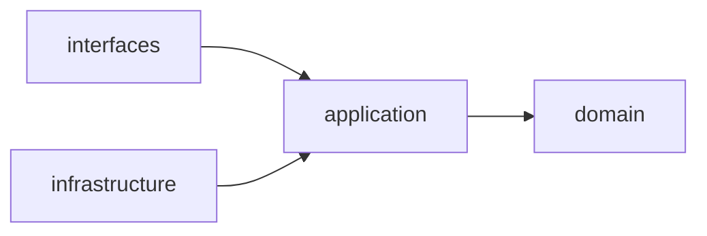

# 개발 룰

이 저장소의 코드가 지켜야 할 규칙. 리뷰에서 매번 다시 다투지 않으려고 미리 정해둔다.
규칙을 어겨야 할 이유가 생기면 [10장](#10-룰을-어겨야-할-때)의 절차를 따른다.

전체 구성은 [../README.md](../README.md)를 먼저 읽는다. 이 문서는 그 구성을
**코드로 어떻게 배치하느냐**만 다룬다.

---

## 1. 파일

### 1.1 한 파일은 300줄을 넘지 않는다

공백·주석·import를 포함한 실제 줄 수 기준이다. 250줄을 넘으면 리뷰에서 한 번 묻고,
300줄에서 CI가 막는다. 테스트 파일도 똑같이 적용한다.

300줄은 **목표가 아니라 한계**다. 대부분의 파일은 100줄 아래여야 정상이다.
300줄에 가까워졌다는 건 거의 항상 아래 중 하나다.

1. **한 파일에 클래스가 둘 이상** → 1.2 위반이다. 쪼갠다.
2. **유스케이스가 둘 이상** → 유스케이스 하나에 파일 하나.
3. **함수 하나가 100줄** → 계층이 섞인 신호다. 도메인 규칙을 `domain`으로 내린다.
4. **위 셋 다 아닌데 길다** → 책임이 둘이다. 이름을 두 개 붙여보면 갈라지는 자리가 보인다.

길다고 기계적으로 반 잘라 `_part2.py`를 만드는 건 규칙 위반보다 나쁘다.

### 1.2 한 파일에 클래스 하나

엔티티, 값 객체, 데이터클래스, 유스케이스, 리포지토리, 어댑터 전부 해당한다.

- 파일명 = 클래스명의 snake_case. `Transaction` → `transaction.py`,
  `CreateTransaction` → `create_transaction.py`.
- 패키지 `__init__.py`에서 re-export 해 import 경로를 짧게 유지한다.

```python
# src/api/domain/entities/__init__.py
from .budget import Budget
from .transaction import Transaction

__all__ = ["Budget", "Transaction"]
```

```python
# 쓰는 쪽은 짧게
from api.domain.entities import Transaction
```

**유일한 예외**: 그 클래스 *전용*으로만 쓰이는 Enum·TypedDict·상수는 같은 파일에 둔다.
다른 모듈이 import하는 순간 자기 파일로 나간다.

### 1.3 파일 이름

- 모듈·패키지는 snake_case.
- 축약하지 않는다. `txn.py`가 아니라 `transaction.py`.
- `utils.py` · `helpers.py` · `common.py` · `misc.py`는 금지한다.
  무엇이든 들어갈 수 있는 이름에는 결국 무엇이든 들어간다. 그 코드가 무슨 일을 하는지로
  이름을 짓는다 — `money_format.py`, `date_range.py`.

---

## 2. 아키텍처 — Clean Architecture

### 2.1 계층 넷

| 계층 | 들어가는 것 | import해도 되는 것 |
|---|---|---|
| `domain` | 엔티티, 값 객체, 도메인 예외, 도메인 규칙 | **표준 라이브러리만** |
| `application` | 유스케이스, 포트(추상 인터페이스), DTO | `domain` |
| `infrastructure` | 리포지토리 구현, DB 세션, HTTP 클라이언트, LLM 어댑터 | `domain`, `application` |
| `interfaces` | FastAPI 라우터, 요청/응답 스키마, CLI, 템플릿 | `domain`, `application` |

### 2.2 의존 규칙 — 화살표는 안쪽으로만



`domain`은 아무것도 import하지 않는다. sqlalchemy도, pydantic도, fastapi도 `domain`에
들어오지 않는다. 도메인이 바깥을 필요로 하면 `application`에 **포트**(추상 클래스)를 두고
`infrastructure`가 구현한다. 둘을 잇는 일은 조립 지점(`main.py`)에서만 한다.

한 문장 판정법: **`domain` 폴더만 떼어 다른 프로젝트에 붙여도 import 에러가 나지 않아야 한다.**

```python
# src/api/application/ports/transaction_repository.py  — 포트 (추상)
class TransactionRepository(ABC):
    @abstractmethod
    def add(self, transaction: Transaction) -> Transaction: ...

# src/api/infrastructure/repositories/sql_transaction_repository.py  — 구현
class SqlTransactionRepository(TransactionRepository):
    ...
```

유스케이스는 `SqlTransactionRepository`를 모른다. `TransactionRepository`만 안다.
덕분에 application 계층 테스트에 DB가 필요 없다.

### 2.3 서비스끼리 import하지 않는다

`src/api`, `src/agent`, `src/ui`는 서로를 import하지 않는다. 통신 수단은 HTTP 하나뿐이다.
README의 "의존은 한 방향" 규칙을 코드 레벨에서도 그대로 지킨다.

공용 코드가 정말 필요하면 `src/shared`에 두되, **도메인 지식은 넣지 않는다.**
`shared`에 `Transaction`이 생기는 순간 서비스 경계는 사라진 것이다.

### 2.4 계층 깊이는 서비스마다 다르다

- `api` — 네 계층 전부. 도메인 규칙이 사는 곳이다.
- `agent` — 네 계층. `domain`은 도구 스키마와 루프 상태, `application`은 ReAct 루프와
  하네스 정책, `infrastructure`는 litellm 어댑터와 api 클라이언트.
- `ui` — `domain`이 사실상 없다. 화면과 세션뿐이다.

**없는 계층의 빈 폴더를 만들지 않는다.** 필요해질 때 만든다.

---

## 3. 디렉터리 구조

```
account-book/
├── src/
│   ├── shared/                  # 서비스 공통 — 도메인 지식 없음
│   ├── api/
│   │   ├── domain/
│   │   │   ├── entities/        # transaction.py, budget.py, account.py ...
│   │   │   ├── values/          # money.py, period.py ...
│   │   │   └── errors/
│   │   ├── application/
│   │   │   ├── use_cases/       # create_transaction.py, summarize_spending.py ...
│   │   │   ├── ports/           # transaction_repository.py ...
│   │   │   └── dto/
│   │   ├── infrastructure/
│   │   │   ├── db/              # 세션, 매핑
│   │   │   └── repositories/    # sql_transaction_repository.py ...
│   │   ├── interfaces/
│   │   │   ├── routers/
│   │   │   └── schemas/         # 요청·응답 (도메인 객체를 그대로 노출하지 않는다)
│   │   └── main.py              # 조립 지점 — 여기서만 구현체를 주입한다
│   ├── agent/
│   │   ├── domain/              # 도구 스키마, 루프 상태
│   │   ├── application/         # ReAct 루프, 하네스 정책
│   │   ├── infrastructure/      # litellm 어댑터, api HTTP 클라이언트
│   │   ├── interfaces/          # HTTP + SSE 엔드포인트, CLI
│   │   └── main.py
│   └── ui/
│       ├── application/
│       ├── infrastructure/      # api·agent 클라이언트
│       ├── interfaces/          # 라우터, templates/, static/
│       └── main.py
├── tests/                       # src/ 구조를 그대로 미러링 (4장)
├── docs/
├── scripts/                       # 룰 검사 스크립트
├── docker-compose.yml
├── Dockerfile
├── requirements.txt
└── .env.sample
```

---

## 4. 테스트

### 4.1 tests/는 src/를 그대로 미러링한다

```
src/api/domain/entities/transaction.py
  → tests/api/domain/entities/test_transaction.py

src/api/application/use_cases/create_transaction.py
  → tests/api/application/use_cases/test_create_transaction.py
```

파일명은 `test_<원본 파일명>.py`. 폴더 경로는 `src/` 아래 경로와 **한 글자도 다르지 않게** 맞춘다.
테스트를 찾을 때 고민할 일이 없어야 하고, 대응되는 테스트가 없는 파일이 눈에 보여야 한다.

> `tests/` 하위 모든 폴더에 빈 `__init__.py`를 둔다. 없으면 서로 다른 폴더의 같은 이름
> 테스트 파일(`tests/api/.../test_transaction.py`와 `tests/agent/.../test_transaction.py`)에서
> pytest가 import file mismatch 에러를 낸다.

### 4.2 계층별 테스트 전략

| 계층 | 방식 | 외부 의존 |
|---|---|---|
| `domain` | 순수 단위 테스트. 목도 픽스처도 거의 없다 | 없음 |
| `application` | 포트를 가짜 구현(in-memory)으로 갈아끼운 단위 테스트 | 없음 |
| `infrastructure` | 실제 DB 컨테이너 대상 통합 테스트. `@pytest.mark.integration` | DB |
| `interfaces` | `TestClient`로 라우팅·검증·상태코드 | 없음 (유스케이스는 목) |

기본 실행(`pytest -m "not integration"`)은 컨테이너 없이 몇 초 안에 끝나야 한다.

### 4.3 테스트는 LLM을 호출하지 않는다

에이전트 테스트는 응답을 고정한 목으로 돌린다. 실제 모델 호출은 느리고, 비싸고,
매번 다른 답을 준다. 실제 호출이 필요한 확인은 테스트가 아니라 수동 스크립트로 둔다.

---

## 5. 타입과 코드 스타일

### 5.1 타입은 strict로 간다

파이썬을 동적 언어로 쓰지 않는다. `mypy --strict`가 기본이고, 통과하지 못하는 코드는 합치지
않는다. 타입을 나중에 붙이는 일은 없다 — 나중은 오지 않는다.

**적용 범위는 우리가 쓴 코드다.** `src` · `tests` · `scripts`만 본다. PyPI에서 받은 패키지에
타입이 붙어 있는지는 우리 문제가 아니고, 남의 스텁을 맞추느라 시간을 쓰지 않는다.

```toml
# pyproject.toml
[tool.mypy]
python_version = "3.13"
strict = true
warn_unreachable = true
files = ["src", "tests", "scripts"]   # 검사 대상은 우리 코드뿐
plugins = ["pydantic.mypy"]

# 외부 패키지: 따라 들어가되 그쪽 오류는 보고하지 않는다.
follow_imports = "silent"
# 타입이 없는 서드파티를 쓴다는 이유로 우리 코드가 막히지는 않게 한다.
disallow_untyped_calls = false      # 스텁 없는 함수 호출 허용
disallow_subclassing_any = false    # 스텁 없는 베이스 클래스 상속 허용

[[tool.mypy.overrides]]
module = ["litellm.*"]              # 스텁 없는 패키지가 나올 때마다 한 줄 추가한다
ignore_missing_imports = true
```

`strict = true`가 켜는 것 중 **우리 코드에서** 실제로 부딪히는 것들.

| 옵션 | 막아주는 것 |
|---|---|
| `disallow_untyped_defs` | 인자·반환에 타입이 없는 함수 |
| `disallow_incomplete_defs` | 일부만 붙인 함수 |
| `disallow_any_generics` | 벗은 제네릭. `list`가 아니라 `list[Transaction]` |
| `warn_return_any` | `Any`를 그대로 반환하는 것 |
| `warn_unused_ignores` | 필요 없어진 `# type: ignore` |
| `no_implicit_reexport` | `__init__.py`의 import가 자동으로 재수출되는 것 |
| `strict_equality` | 절대 같을 수 없는 값끼리의 `==` |

위 설정에서 끈 둘(`disallow_untyped_calls`, `disallow_subclassing_any`)은 전부 **남의 코드가
타입을 안 붙였을 때** 걸리는 것들이다. 우리가 쓴 함수에 타입이 없으면 `disallow_untyped_defs`가
그대로 잡는다. 느슨해지는 건 경계 바깥뿐이다.

> **`no_implicit_reexport`는 1.2의 re-export 패턴과 맞물린다.** `__init__.py`에
> `from .transaction import Transaction`만 써두면 strict에서 그 이름은 밖으로 나가지 않는다.
> `__all__`에 넣거나 `import Transaction as Transaction`으로 써야 통과한다.
> 1.2의 예시가 `__all__`을 포함하는 이유다.

### 5.2 `Any`는 경계에서만

`Any`는 타입 검사를 끄는 스위치다. 쓸 자리는 하나뿐이다 — 외부에서 들어온 JSON처럼
**아직 모양을 모르는 데이터**를 받는 순간. 받자마자 검증해서 타입이 있는 객체로 바꾸고,
그 뒤로는 들고 다니지 않는다.

```python
# interfaces — 바깥과 닿는 자리
def handle(payload: dict[str, Any]) -> TransactionResponse:
    request = CreateTransactionRequest.model_validate(payload)   # Any는 여기서 끝난다
    ...
```

`Any`가 `application`이나 `domain`에서 보이면 경계를 넘어 들어온 것이다.

**스텁 없는 라이브러리의 반환값도 `Any`다.** 그 값을 그대로 안으로 흘리지 않는다.
`infrastructure`의 어댑터가 받아서 우리 타입으로 바꾸고, 그 지점부터 안쪽은 전부 타입이 있다.
어댑터가 `Any`를 막는 벽이다.

```python
# src/agent/infrastructure/llm/litellm_client.py
def complete(self, messages: list[Message]) -> Completion:
    raw = litellm.completion(model=self._model, messages=[m.to_dict() for m in messages])
    return Completion.from_raw(raw)   # Any는 이 줄에서 끝난다
```

`warn_return_any`가 켜져 있으니, 어댑터가 `raw`를 그대로 반환하면 CI가 잡는다.

`# type: ignore`도 같다. 코드 없는 알몸 `# type: ignore`는 금지한다. 항상
`# type: ignore[arg-type]`처럼 무엇을 끄는지 밝히고, 왜인지 한 줄 남긴다.

### 5.3 원시 타입을 그대로 쓰지 않는다

`str` 하나가 여기저기서 다른 뜻으로 쓰이면 타입 검사기는 아무것도 막지 못한다.
식별자는 `NewType`으로, 의미가 있는 값은 값 객체로 감싼다.

```python
# src/api/domain/values/transaction_id.py
TransactionId = NewType("TransactionId", str)

# src/api/domain/values/money.py
@dataclass(frozen=True, slots=True)
class Money:
    amount: int                  # 최소단위(원). float는 쓰지 않는다
    currency: str = "KRW"
```

`get(TransactionId)` 자리에 `CategoryId`를 넘기면 mypy가 막는다.
둘 다 그냥 `str`이었다면 못 막는다. strict로 가는 값어치의 절반은 여기서 나온다.

### 5.4 계층마다 타입을 표현하는 수단이 다르다

| 계층 | 수단 | 이유 |
|---|---|---|
| `domain` | `@dataclass(frozen=True, slots=True)`, `NewType`, `Enum` | 프레임워크를 모른다 (2.2) |
| `application` | dataclass DTO, `Protocol` 또는 `ABC` 포트 | 표준 라이브러리로 충분하다 |
| `infrastructure` | 각 라이브러리의 타입 | 어차피 바깥이다 |
| `interfaces` | pydantic 모델 | 런타임 검증이 필요한 유일한 자리 |

pydantic은 **바깥과 닿는 경계에서만** 쓴다. 도메인 엔티티를 pydantic으로 만들면
`domain`이 서드파티에 의존하게 되고 2.2가 깨진다.

### 5.5 그 밖의 스타일

- 모든 파일 맨 위에 `from __future__ import annotations`.
- 금액은 정수 최소단위(원). `float` 금지. 값 객체 `Money`를 쓴다.
- 도메인 객체를 API 응답으로 그대로 내보내지 않는다. `interfaces/schemas`를 거친다.
- 예외는 계층에서 번역한다. `domain`의 `BudgetExceeded`가 `interfaces`에서 HTTP 409가 된다.
  `sqlalchemy` 예외가 라우터까지 올라오면 계층이 샌 것이다.
- 주석은 "무엇"이 아니라 "왜"를 적는다. 코드를 읽으면 아는 걸 반복하지 않는다.

---

## 6. 파이썬 실무 규칙

### 6.1 시간 — 저장은 UTC, 경계는 사용자 타임존

가계부에서 "어제 점심"이 어느 날인지는 규칙이지 상식이 아니다. 정해두지 않으면 자정 근처와
월말 거래가 엉뚱한 날짜로 들어간다.

- **naive datetime 금지.** 모든 `datetime`은 tz-aware다. DB 컬럼은 `TIMESTAMPTZ`.
- **저장은 UTC.** 표시와 경계 계산은 사용자 타임존(기본 `Asia/Seoul`).
- **"어제"·"이번 달"의 경계는 사용자 타임존 기준으로 잡고 UTC로 바꿔 조회한다.**
  2026-09월 = `[2026-09-01T00:00+09:00, 2026-10-01T00:00+09:00)`.
  끝은 열린 구간이다. `<= 말일 23:59:59`로 자르지 않는다.
- 자연어를 날짜로 바꾸는 쪽(에이전트)은 **기준 시각과 타임존을 인자로 받는다.** 추측하지 않는다.
- `occurred_at`(사용자가 말한 시점)과 `created_at`(기록된 시각)은 다른 값이다. 섞지 않는다.

`datetime.now()`를 직접 부르지 않는다. 그 함수는 테스트할 수 없다. 시계도 포트다.

```python
# src/api/application/ports/clock.py
class Clock(ABC):
    @abstractmethod
    def now(self) -> datetime: ...      # 언제나 aware, UTC
```

### 6.2 async / sync 경계

**`api`는 동기, `agent`와 `ui`는 async.** 서비스마다 하는 일이 달라서다.

- `api`가 하는 I/O는 짧은 DB 호출뿐이다. 동기 SQLAlchemy + `def` 라우터로 두면
  FastAPI가 알아서 스레드풀에서 돌린다. async를 네 계층에 전염시킬 값어치가 없다.
- `agent`·`ui`는 30초짜리 LLM 호출과 SSE 스트리밍을 다룬다. 여기는 async가 맞다.

어느 쪽이든 **`domain`은 언제나 동기다.** 도메인 규칙에 `await`가 낄 이유는 없다.

**`async def` 안에서 블로킹 호출을 하지 않는다.** 동기 DB 드라이버, `requests`,
`time.sleep`, 동기 `litellm.completion` — 하나라도 섞이면 이벤트 루프 전체가 멈춘다.
요청 하나가 다른 모든 요청을 세운다. 불가피하면 어댑터 안에서 감싼다.

```python
result = await anyio.to_thread.run_sync(blocking_call, arg)
```

동기와 비동기가 만나는 지점은 `infrastructure`의 어댑터 한 곳뿐이어야 한다.

### 6.3 설정은 한 곳에서만 읽는다

`os.environ`을 아무 데서나 읽지 않는다. 서비스마다 한 파일에서만 읽고, 나머지는 주입받는다.

```python
# src/api/infrastructure/config.py
class Settings(BaseSettings):
    database_url: str                      # 기본값 없음 = 필수
    user_timezone: str = "Asia/Seoul"
    model_config = SettingsConfigDict(env_file=".env")
```

- `domain`과 `application`은 환경변수의 존재를 모른다. 설정 객체는 `main.py`에서 만들어 넣는다.
- 시크릿에는 기본값을 주지 않는다. 없으면 뜨는 순간 죽는 게 낫다.
- **`.env.sample`과 `Settings` 필드는 1:1이다.** 하나를 추가하면 둘 다 고친다.

### 6.4 로깅 — 운영 로그와 감사 로그를 나눈다

개인 재무 데이터를 다룬다. 무엇을 남기느냐보다 **무엇을 남기지 않느냐**가 먼저다.

| | 애플리케이션 로그 | 감사 테이블 (`agent_runs` · `tool_calls`) |
|---|---|---|
| 남기는 것 | 식별자, 도구명, 소요 시간, 토큰 수, 결과 코드 | 사용자 발화, 도구 인자, 금액, 가맹점 |
| 성격 | 운영자가 본다. 수집기로 흘러간다 | DB 안에 있고 접근 통제를 받는다 |

- 로그에 **API 키·세션 토큰·사용자 발화 원문·금액·가맹점명을 넣지 않는다.**
  "어느 거래인지"는 `transaction_id`로 충분하다.
- 모든 로그에 상관관계 id를 붙인다 — `api`는 `request_id`, `agent`는 `run_id`.
  `ui`가 만든 `request_id`를 헤더로 끝까지 전파한다.
- `print()` 금지. 표준 `logging`에 JSON 포맷터, 한 줄에 한 이벤트.
- **로깅하고 다시 raise하지 않는다.** 같은 예외가 스택마다 찍힌다. 처리하는 곳에서 한 번만 남긴다.

### 6.5 예외

계층마다 베이스를 두고, 경계를 넘을 때 번역한다. `sqlalchemy` 예외가 라우터까지 올라오면
계층이 샌 것이다(5.5).

| 도메인 예외 | HTTP | 에러 코드 |
|---|---|---|
| `TransactionNotFound` | 404 | `not_found` |
| `InvalidTransaction` | 422 | `validation_error` |
| `BudgetExceeded` | 409 | `budget_exceeded` |
| `ConfirmationRequired` | 412 | `confirmation_required` |
| `PermissionDenied` | 403 | `permission_denied` |
| 그 밖의 모든 것 | 500 | `internal_error` |

- 500 응답에 내부 정보를 담지 않는다. 스택 트레이스·SQL·파일 경로는 로그에만 남는다.
- 예외 메시지에 시크릿을 넣지 않는다. 메시지는 사용자에게 보일 수 있다.
- `except Exception: pass` 금지. 삼킬 거라면 왜 삼키는지 주석을 남긴다.
- 전체 계약은 [api-contract.md](api-contract.md)에 있다.

---

## 7. 검사

규칙은 사람이 기억하는 게 아니라 두 지점에서 걸린다.

**1) feature를 finish하기 전** — 바뀐 파일을 AI 에이전트가 이 문서 기준으로 훑는다.
300줄처럼 기계적인 건 스크립트로 세고, "이 클래스가 이 계층에 있는 게 맞나" 같은 판단은
읽고 본다. 절차는 [git-flow-guide.md 3장](git-flow-guide.md#3-finish-전-점검--ai-에이전트가-한다).

```bash
git diff --name-only --diff-filter=d develop...HEAD   # 점검 대상
python3 scripts/check_file_length.py --base develop   # 300줄 상한
python3 scripts/check_docs.py                         # 문서끼리 어긋난 곳
```

문서를 고쳤다면 `check_docs.py`를 먼저 돌린다. 장 번호·앵커·도구 이름·에러 코드가
문서 넷에 흩어져 있어서, 하나를 고치면 다른 셋이 조용히 어긋난다. 사람이나 에이전트가
문서를 통째로 다시 읽으며 대조할 일이 아니다.

**2) CI** — 기계가 판정할 수 있는 것 전부.

```bash
ruff check src tests            # 린트 + import 정렬
ruff format --check src tests   # 포맷
mypy                            # 타입 — 우리 코드만 strict (설정은 pyproject.toml)
lint-imports                    # 계층·서비스 의존 규칙 (import-linter)
python3 scripts/check_file_length.py  # 300줄 상한 (전체)
python3 scripts/check_docs.py   # 문서 간 참조
pytest -m "not integration"     # 단위 테스트
```

`import-linter` 계약 예시 — 2.2와 2.3을 그대로 강제한다.

```ini
[importlinter:contract:api-layers]
name = api 계층은 안쪽으로만 의존한다
type = layers
layers =
    interfaces
    application
    domain
containers = api

[importlinter:contract:service-isolation]
name = 서비스끼리 import하지 않는다
type = independence
modules =
    api
    agent
    ui
```

---

## 8. 커밋·브랜치

git-flow(classic). `main`은 릴리스, `develop`이 기본, 기능은 `feature/*`.
브랜치를 따고 합치는 절차와 finish 전 점검은 [git-flow-guide.md](git-flow-guide.md)에 있다.

커밋 메시지는 `<type>: <한 줄 요약>` — `feat` / `fix` / `docs` / `refactor` / `test` / `chore`.
**왜 그렇게 했는지**는 본문에 적는다. 나중에 그 판단을 뒤집으려는 사람이 읽을 유일한 글이다.

---

## 9. 새 코드를 넣기 전 체크리스트

- [ ] 이 클래스는 어느 계층인가? 그 계층이 import해도 되는 것만 import하는가?
- [ ] 파일에 클래스가 하나인가? 파일명이 클래스명과 일치하는가?
- [ ] 300줄 아래인가? (100줄을 넘었다면 한 번 더 본다)
- [ ] `tests/`의 같은 경로에 테스트가 있는가?
- [ ] `domain`에 프레임워크가 들어오지 않았는가?
- [ ] 다른 서비스를 import하지 않았는가?
- [ ] `mypy` strict를 통과하는가?
- [ ] 새로 생긴 `Any`나 알몸 `# type: ignore`가 없는가?
- [ ] `datetime`이 전부 aware인가? `datetime.now()`를 직접 부르지 않았는가?
- [ ] `async def` 안에 블로킹 호출이 없는가?
- [ ] `os.environ`을 설정 파일 밖에서 읽지 않았는가?
- [ ] 로그에 금액·가맹점·발화 원문·키가 들어가지 않았는가?

---

## 10. 룰을 어겨야 할 때

규칙이 코드를 나쁘게 만드는 순간이 온다. 그때는 어긴다. 대신 조용히 어기지 않는다.

1. PR 본문에 **어떤 규칙을, 왜** 어겼는지 적는다.
2. 코드에 `# rule-exception: <규칙> — <이유>` 주석을 남긴다.
3. 같은 예외가 세 번 나오면 예외가 아니라 **규칙이 틀린 것**이다. 이 문서를 고친다.
