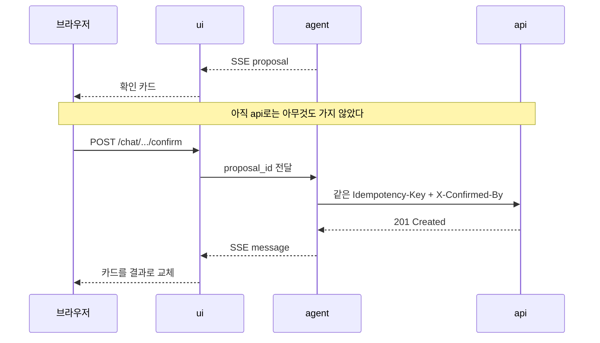

# 채팅 화면

## 1. 목적

한 줄로 기록하고 한 줄로 묻는다. "어제 점심 김밥천국 8500원 카드로"를 폼 일곱 칸으로
옮기는 노동을 없애는 게 이 화면의 존재 이유다. 손이 하나일 때, 걸어가면서, 계산 직후에
쓰는 화면이다. 정확히 여러 건을 넣을 때는 [거래 폼](transaction-form.md)이 낫다.

## 2. 라우트와 데이터

| | |
|---|---|
| 경로 | `/` |
| 부르는 곳 | `agent` — `POST /chat` (SSE 스트림), `POST /chat/{run_id}/confirm` |
| `api` 직접 호출 | 없다 |

`ui`는 `agent`의 스트림을 받아 브라우저로 중계한다. 이 화면에서 `api`를 직접 부르는 일은
없다. 그래야 에이전트가 자기가 제안한 일이 실행됐는지 안다.

## 3. 화면 구조

위에서 아래로 세 영역이다.

| 영역 | 내용 |
|---|---|
| 상단 | 이번 달 지출 합 한 줄. 누르면 [리포트](reports.md)로 간다 |
| 대화 | 말풍선이 쌓인다. 아래가 최신. 새 줄이 오면 맨 아래로 따라간다 |
| 입력 | 한 줄 입력창 + 보내기. `Enter` 전송, `Shift+Enter` 줄바꿈 |

대화 영역에 놓이는 것은 다섯 종류다.

| 종류 | 생김새 |
|---|---|
| 사용자 말풍선 | 오른쪽 |
| 에이전트 말풍선 | 왼쪽. 토큰이 오는 대로 이어 붙는다 |
| 진행 줄 | "거래를 찾는 중…" — 말풍선이 아니라 옅은 한 줄 |
| 확인 카드 | 5장 |
| 에러 줄 | 붉은 테두리 한 줄 + `request_id` |

## 4. 상호작용

### 4.1 SSE 이벤트가 화면으로

| 이벤트 | 담긴 것 | 화면에서 |
|---|---|---|
| `token` | 부분 텍스트 | 말풍선에 이어 붙인다 |
| `tool` | 도구 이름 | 진행 줄을 "거래를 찾는 중…"으로 바꾼다 |
| `proposal` | 쓰기 제안 | 확인 카드를 그린다 |
| `message` | 완결된 답변 | 말풍선을 확정하고 진행 줄을 지운다 |
| `error` | `code`, `message`, `request_id` | 에러 줄 |
| `done` | — | 입력창을 다시 연다 |

`tool` 이벤트에 **도구 인자를 싣지 않는다.** 화면에 필요한 건 "무엇을 하는 중"이지
"어떤 값으로 조회하는 중"이 아니다. 로그 규칙과 같은 이유다
([../../docs/development-rules.md 6.4](../../docs/development-rules.md#64-로깅--운영-로그와-감사-로그를-나눈다)).

### 4.2 스트림이 끊기면

브라우저가 `run_id`를 들고 재연결한다. `agent`는 그 시점부터 이어 보낸다.
이미 화면에 그려진 토큰을 다시 받으면 무시한다 — 중복 렌더를 막는 건 화면 쪽 일이다.

재연결이 세 번 실패하면 "연결이 끊겼어요. 다시 보내기" 버튼을 띄운다. 자동으로
영원히 재시도하지 않는다.

## 5. 확인 카드

에이전트가 돈 기록을 바꾸려 할 때 사용자가 보는 화면이다. **이 화면에서 가장 중요한 부분이다.**

### 5.1 카드에 담기는 것

> **이렇게 기록할게요**
>
> 2026-09-16 · 식비 · **8,500원**
> 카드 · 김밥천국
>
> `취소`  `확인`

| 영역 | 값 | 어디서 오나 |
|---|---|---|
| 제목 | 고정 문구 | `ui` |
| 첫 줄 | 날짜 · 카테고리 · 금액 | `proposal.summary` |
| 둘째 줄 | 결제수단 · 가맹점 | `proposal.detail` |
| 버튼 | 취소 / 확인 | `proposal.proposal_id`를 실어 보낸다 |

금액은 굵게 낸다. 사용자가 이 카드에서 확인해야 할 건 결국 숫자 하나다.

### 5.2 확인이 오가는 순서

**`ui`는 확인된 쓰기를 `api`로 직접 보내지 않는다.** 확인은 대화 맥락에 속하고, 그 맥락을
들고 있는 건 `agent`다. `ui`가 질러버리면 `agent`는 자기가 제안한 일이 실행됐는지 모른다.

취소를 누르면 `agent`에 알린다. 조용히 카드만 지우면 에이전트는 계속 기다린다.

카드는 답을 받기 전까지 버튼을 잠그지 않는다. 대신 누른 뒤에 잠근다 — 두 번 눌러
같은 제안이 두 번 가는 걸 막는다.

## 6. 빈 상태·로딩·에러

**빈 상태(첫 방문)** — 에이전트 화면의 가장 큰 문제는 *무엇을 말해야 할지 모른다*는 것이다.
예시 세 개를 눌러서 보낼 수 있게 둔다.

> 이렇게 말해보세요
> `어제 점심 8,000원` · `이번 달 식비 얼마 썼어?` · `카페에 쓴 돈 보여줘`

**로딩** — 보내기를 누르면 즉시 사용자 말풍선을 그리고 진행 줄을 띄운다. 서버 응답을
기다렸다가 그리지 않는다.

**한계에 걸렸을 때** — 스텝이나 비용 상한에 닿으면 `agent`가 루프를 끊는다. 화면은
"여기까지 해봤어요"와 지금까지의 답을 남기고, 다시 시도할지 묻는다. 조용히 멈추지 않는다.

## 7. 결정과 이유

- **`api`를 직접 부르지 않는다.** 목록 한 줄을 그리려고 `api`를 부르고 싶어지는 순간이
  오는데, 그러면 두 진실이 생긴다. 필요한 건 전부 `agent`가 스트림에 실어 보낸다.
- **진행 줄은 말풍선이 아니다.** 말풍선으로 만들면 대화 기록에 쓰레기가 쌓인다.
  `message`가 오면 사라져야 하는 것이다.
- **대화 기록은 화면에 최근 것만 둔다.** 전체는 `agent_runs`에 있다. 화면이 무거워지면
  옛날 것부터 접는다.

## 8. 하지 않는 것

- 음성 입력, 이미지·영수증 업로드. OCR은 아직 범위 밖이다.
- 대화 검색. 찾는 건 [거래 목록](transactions.md)에서 한다.
- 여러 대화 스레드. 하나의 이어지는 대화만 둔다.
