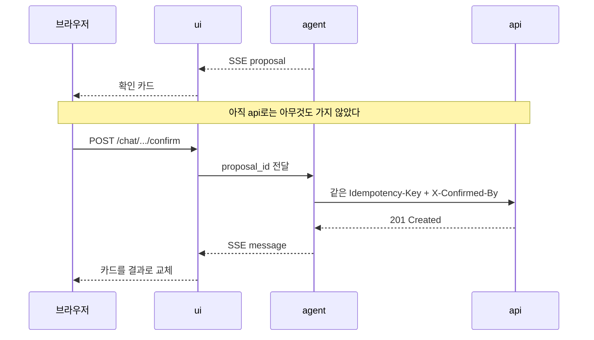

# ui 설계

`ui`는 화면 서버다. 브라우저가 닿는 유일한 곳이고, 도메인 로직은 하나도 갖지 않는다.
전체 구성은 [../README.md](../README.md) 3장에 있다.

**한다** — 화면을 그린다. 세션을 들고 있다. 사용자의 신원을 뒤쪽으로 전파한다.

**안 한다** — 금액을 계산하지 않는다. 카테고리를 추론하지 않는다. 권한을 판단하지 않는다.
DB도 LLM도 모른다. 하나라도 하기 시작하면 같은 규칙이 두 군데에 생긴다.

---

## 1. 화면과 라우트

| 경로 | 화면 | 뒤에서 부르는 곳 |
|---|---|---|
| `/` | 채팅 | `agent` (SSE) |
| `/transactions` | 거래 목록·필터 | `api` |
| `/transactions/{id}` | 거래 상세·수정 | `api` |
| `/transactions/new` | 수동 입력 폼 | `api` |
| `/reports/{period}` | 월간 리포트 | `api` |
| `/budgets` | 예산 설정 | `api` |

**대화는 `agent`, 그 밖의 모든 것은 `api`다.** 목록을 보거나 거래를 직접 고치는 데
에이전트를 거칠 이유가 없다. 느리고, 비싸고, 틀릴 수 있다.

---

## 2. 입력 경로는 둘이다

거래를 넣는 길이 두 개이고, **둘은 대등하다.** 대화가 본 기능이고 폼이 보조가 아니다.
말로 하는 게 빠른 순간이 있고, 손으로 넣는 게 정확한 순간이 있다.

| | 대화 입력 | 직접 입력 |
|---|---|---|
| 화면 | `/` 채팅 | `/transactions/new` 폼 |
| 누가 구조화하나 | 에이전트가 자연어에서 필드를 뽑는다 | 사용자가 필드에 직접 넣는다 |
| 거치는 서버 | `agent` → `api` | `api` 직접 |
| 확인 | 확인 카드 (4장) | 제출이 곧 확인 (5.3) |
| `Idempotency-Key` | `{run_id}:{호출 순번}` — `agent`가 만든다 | 폼을 열 때 `ui`가 만든 UUID |
| 거래의 `source` | `agent` | `manual` |
| 잘 맞는 때 | 한 건, 이동 중, 손이 하나일 때 | 여러 건, 영수증 보며, 금액이 클 때 |

**둘은 같은 `api` 엔드포인트로 들어간다.** 길이 둘이어도 검증과 권한은 하나다.
`source`만 다르게 남아서 나중에 "이건 누가 넣었지"에 답할 수 있다.

### 2.1 방향(지출·수입)은 화면 어디서나 같게 보인다

- 지출은 `-`, 수입은 `+`를 **숫자 앞에 붙인다.** 색으로만 구분하지 않는다.
  색각 이상인 사람에게는 빨강과 초록이 같은 색이다.
- 합계는 순액 하나로 내지 않는다. 지출 합과 수입 합을 따로 낸다.
  "이번 달 -120,000원"은 아무것도 말해주지 않는다.

---

## 3. 대화 입력 — SSE로 흘려보낸다

`ui`가 `agent`의 스트림을 받아 그대로 브라우저로 중계한다. 이벤트는 여섯 가지다.

| 이벤트 | 담긴 것 | 화면에서 |
|---|---|---|
| `token` | 부분 텍스트 | 말풍선에 이어 붙인다 |
| `tool` | 도구 이름 | "거래를 찾는 중…" 같은 한 줄로 바꿔 보여준다 |
| `proposal` | 쓰기 제안 (4장) | 확인 카드를 그린다 |
| `message` | 완결된 답변 | 말풍선을 확정한다 |
| `error` | `code`, `message`, `request_id` | 5장 매핑대로 |
| `done` | — | 입력창을 다시 연다 |

`tool` 이벤트에 **도구 인자를 싣지 않는다.** 화면에 필요한 건 "무엇을 하는 중"이지
"어떤 값으로 조회하는 중"이 아니다. 로그 규칙과 같은 이유다
([../docs/development-rules.md 6.4](../docs/development-rules.md#64-로깅--운영-로그와-감사-로그를-나눈다)).

---

## 4. 쓰기 확인 카드

에이전트가 돈 기록을 바꾸려 할 때 사용자가 보는 화면이다. **`ui` 설계에서 가장 중요한 부분이다.**

### 4.1 카드에 담기는 것

> **이렇게 기록할게요**
>
> 2026-09-16 · 식비 · **8,500원**
> 카드 · 김밥천국
>
> `취소`  `확인`

| 영역 | 값 | 어디서 오나 |
|---|---|---|
| 제목 | 고정 문구 | `ui` |
| 첫 줄 | 날짜 · 카테고리 · 금액 | `proposal.summary` |
| 둘째 줄 | 결제수단 · 가맹점 | `proposal.detail` |
| 버튼 | 취소 / 확인 | `proposal.proposal_id`를 실어 보낸다 |

금액은 굵게 낸다. 사용자가 이 카드에서 확인해야 할 건 결국 숫자 하나다.

### 4.2 확인이 오가는 순서



**`ui`는 확인된 쓰기를 `api`로 직접 보내지 않는다.** 확인은 대화 맥락에 속하고, 그 맥락을
들고 있는 건 `agent`다. `ui`가 질러버리면 `agent`는 자기가 제안한 일이 실행됐는지 모른다.

예외는 `/transactions/new`의 **수동 입력 폼**이다. 대화가 없으므로 `ui`가 `api`를 직접
부르고, `Idempotency-Key`는 폼을 열 때 `ui`가 만든 UUID를 쓴다. 새로고침으로 같은 폼을
두 번 제출해도 거래는 하나만 생긴다
([../docs/api-contract.md 3장](../docs/api-contract.md#3-멱등성--같은-거래가-두-번-들어가지-않게)).

취소를 누르면 `agent`에 알린다. 조용히 카드만 지우면 에이전트는 계속 기다린다.

---

## 5. 직접 입력 폼

`/transactions/new`. 대화 없이 사용자가 직접 구조화한다.

### 5.1 필드와 순서

| 순서 | 필드 | 기본값 | 비고 |
|---|---|---|---|
| 1 | **방향** | 지출 | 지출·수입 라디오. 가장 먼저 고른다 |
| 2 | 금액 | — | 정수 원. 천 단위 구분은 표시만, 전송은 정수 |
| 3 | 날짜·시각 | 지금 (사용자 타임존) | |
| 4 | 카테고리 | 방향에 따라 목록이 바뀐다 | |
| 5 | 결제수단 | 마지막에 쓴 것 | |
| 6 | 가맹점 | — | 선택. 넣으면 카테고리를 제안한다 (5.2) |
| 7 | 메모 | — | 선택 |

**방향을 가장 먼저 고르는 이유**는 카테고리 목록이 방향에 딸려 있기 때문이다.
지출 목록에 "급여"가, 수입 목록에 "식비"가 보이면 안 된다. 방향 라디오를 바꾸면
카테고리 셀렉트만 부분 갱신한다 — HTMX를 쓰는 전형적인 자리다(8장).

### 5.2 카테고리 제안은 쓰되, 대화는 아니다

가맹점을 넣고 포커스를 옮기면 `ui`가 `POST /v1/categories/suggest`를 **직접** 부른다.
읽기 도구라 확인이 필요 없고, `agent`를 거칠 이유도 없다.

- 제안은 **기본 선택을 채우는 데까지만** 쓴다. 사용자가 바꾸면 그 선택이 이긴다.
- 제안의 근거를 설명하지 않는다. 설명이 필요한 순간이면 그건 대화가 할 일이다.

### 5.3 확인은 제출이 대신한다

폼 제출은 사용자가 모든 필드를 눈으로 보고 누른 것이다. 확인 카드를 또 띄우지 않는다.
`ui`가 `X-Confirmed-By: user`를 붙여 `api`를 직접 부른다.

`Idempotency-Key`는 **폼을 열 때** 만든다. 제출할 때 만들면 새로고침 후 재제출이
새 키를 받아 거래가 둘이 된다
([../docs/api-contract.md 3장](../docs/api-contract.md#3-멱등성--같은-거래가-두-번-들어가지-않게)).

### 5.4 검증은 두 군데서 하지만 진실은 한 곳이다

폼의 필수값·숫자 검사는 화면 편의일 뿐이다. 진짜 검증은 `api`가 한다.
`ui`는 `validation_error`의 `details`를 받아 해당 필드 옆에 표시하고, 나머지 입력값은
그대로 둔다. 폼 전체를 다시 그리면 사용자가 쓴 것이 날아간다.

### 5.5 수정도 같은 폼이다

`/transactions/{id}`는 값이 채워진 같은 폼이다. `PATCH`로 보내고 `Idempotency-Key`는
마찬가지로 화면을 열 때 만든다. 삭제만 다르다 — 항상 따로 확인을 묻는다.

---

## 6. 세션과 신원

`ui`는 세션 쿠키를 갖는 **유일한** 서버다. `agent`와 `api`는 쿠키를 모른다.

| 헤더 | `ui`가 하는 일 |
|---|---|
| `X-User-Id` | 세션에서 꺼내 붙인다. **브라우저가 보낸 값은 쓰지 않는다** |
| `X-Request-Id` | 요청마다 새로 만들어 붙이고, 에러 화면에도 보여준다 |

`X-Request-Id`를 화면에 노출하는 건 사용자가 문의할 때 쓰라고 두는 것이다. 그 한 줄이면
로그에서 해당 요청을 바로 찾는다.

헤더 규약 전체는 [../docs/api-contract.md 2장](../docs/api-contract.md#2-헤더--누가-무엇을-대신하는가)에 있다.

---

## 7. 에러를 화면에 옮기는 법

`api`의 `code`로 분기한다. `message` 문자열을 파싱하지 않는다.

| `code` | 화면 |
|---|---|
| `not_found` | "그 거래를 찾지 못했어요" |
| `validation_error` | 폼 필드 옆에 표시. 페이지를 갈아엎지 않는다 |
| `budget_exceeded` | 경고 배너. **막지는 않는다** — 예산을 넘겨 쓸 자유는 사용자에게 있다 |
| `confirmation_required` | 확인 카드를 다시 띄운다 |
| `permission_denied` | "권한이 없습니다" |
| `internal_error` | "문제가 생겼어요" + `request_id` |

`idempotency_key_reused`와 `request_in_progress`는 화면에 오지 않는다. `agent`가 처리한다.

---

## 8. HTMX 사용 규칙

템플릿은 금방 엉킨다. 규칙을 먼저 정한다.

- **페이지는 서버가 완성해서 보낸다.** HTMX는 그 뒤의 부분 갱신에만 쓴다.
- 부분 갱신 하나 = 템플릿 partial 하나 = `templates/partials/` 아래 파일 하나.
- `ui` 라우트는 HTML 조각을 반환한다. JSON을 반환하는 건 확인 액션 같은 예외뿐이다.
- `hx-target`은 **항상 id로** 지정한다. 클래스 선택자는 쓰지 않는다 — 같은 클래스가
  둘이 되는 순간 엉뚱한 곳이 갱신되고, 그 버그는 재현이 어렵다.
- 한 번에 세 군데 이상을 갱신해야 한다면 그건 부분 갱신이 아니라 페이지 전환이다.

전형적인 쓰임은 입력 폼의 방향 라디오다. 지출·수입을 바꾸면 카테고리 셀렉트 하나만
갈아끼운다. 페이지는 그대로 있고, 사용자가 이미 넣은 금액과 날짜도 그대로 있다.

```html
<input type="radio" name="direction" value="income"
       hx-get="/partials/category-select?direction=income"
       hx-target="#category-select" hx-swap="outerHTML">
```
- 커스텀 JS가 필요해지면 그 화면이 HTMX의 범위를 넘었다는 신호다. 몰래 늘리지 말고
  이 문서에 적고 이야기한다.

채팅만 예외다. SSE 수신과 말풍선 이어 붙이기는 작은 JS가 필요하다. 그 JS는 한 파일에 둔다.

---

## 9. 지금 하지 않는 것

- 다크 모드, 다국어. 한국어 단일 사용자로 시작한다.
- 오프라인 저장, PWA.
- 차트 라이브러리. 리포트는 숫자와 표로 먼저 만든다. 그림이 필요한지 써 보고 정한다.
- 모바일 앱. 화면은 좁은 폭에서 읽히기만 하면 된다.
